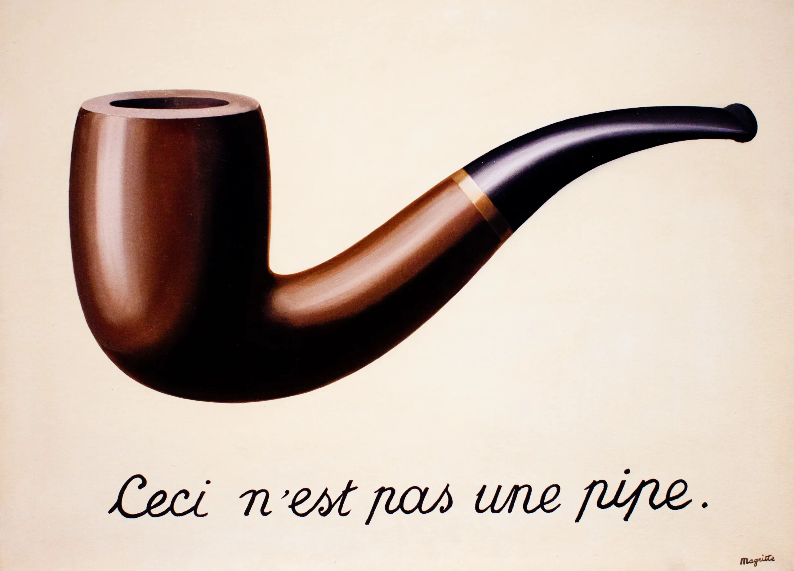

In trading, a necessary condition to make money is to have a model with _predictive power_. It should be able to predict, better[^1] than other market participants, where the price of something is going to be _in the future_. Using this, you can do trades which are considered “+EV” (i.e., would make money on average). If you think something is going to trade at $5.05 in the next 30 seconds, you’re happy to buy at $5.01 or sell at $5.08 for example.

Importantly, you don’t make money simply by being able to explain the past. You can whine and say “oh man, I knew it was going to happen” but unfortunately you can’t go back in time to do the trade. At best, you can count it as an intellectual win and brag about it to others. But intellectual victories don’t pay the bills.[^2]

To be able to predict the future, you need to first have an accurate model of the world. A model of the world is like a map of a city. It’s not perfect - it misses some details, it abstracts some things away. But as long as a map helps you get around the city, it’s a useful map. The same holds for models of the world (aka “world models”).

As long as the model has predictive power, it is a useful model.

A child learns about the concept of gravity in the world much before he learns about the formula for F = G m1 m2 / r^2 or even the fact that g ~ 9.8m/s^2. He knows that if he throws a ball in the air, it’s going to come down. He knows if he jumps off a chair, he’s going to fall down on the floor. He doesn't need to know the formulae to be able to predict what is going to happen in the future. He doesn’t even need to know the word “gravity”. He has learnt the concept, and _that_ is what has predictive power.

Sure, he won’t be able to _precisely_ predict how much time it’d take for the ball to come back down - but his world model is good enough for his use-cases.

In the same way, we build models of everything in the world, intuitively, implicitly. Even if we can’t put it into words. We have models in our head of how certain people - our friends, family members - behave. We have models of how things work - businesses, schools, governments.

(Importantly, this is different from how you might think people _should_ behave or how things _should_ work. One is trying to model how things are, the other is your wish for how things should be.)

We have models for literally everything in our life because everything in the real, physical world also exists - in an abstract sense - somewhere in our head. Maybe not explicitly. But if we didn’t have a model for something, we wouldn’t know what to think when we saw the thing in the real world. We wouldn’t know what it was we were looking at / experiencing.

We use these models to make sense of the world and predict what’s going to happen. Before we take any action, we can “simulate” it in our head - using our world model. If the world model is ~correct, it should match ~closely what happens in real life. If this is true, we can simulate many different actions (i.e., consider possible options) and then decide which one we’d like to take depending on the outcomes we expect to see in the real world.

The only requirement of this model is that it should have predictive power. It must be able to, given the current state of the world and an action, tell you what happens if you take that action. Almost nothing else matters.

If you’re in New York and someone gives you a beautifully drawn, colourful map of Amsterdam, it’s going to be useless for navigating purposes. You’re not going to be able to use it to get back home. You’d much rather have a rough sketch of New York.

This is not a pipe - it’s a _picture_ of a pipe, a representation. The map is not the territory.

The beauty of a model is only in whether it can predict the future.

Many fields of study aim to do this in some or the other way. Game theory tries to model and predict human behaviour in multiplayer situations (e.g. prisoner’s dilemma). Microeconomics tries to model and predict how people’s decisions change when certain factors change (e.g. costs, income, etc.). Similarly, macroeconomics tries to answer the same questions but on a population-level (e.g interest rates ←→ unemployment). Psychology is about predicting how people’s thinking and decision-making is affected respond to incentives, social pressures, framing, etc.

All these sciences are trying to come up with ways to model the world. Every new theory we learn hopefully makes our world-model more accurate / complete. So that we can make better decisions.[^3] That’s pretty much it.

Trading is an obvious example of a domain in which it’s more important to be right than just convincing people you’re right. (And maybe that’s why I really enjoy it.) You can slice the data however you want to persuade people you have a brilliant idea (“alpha”), but as long as you’re not _actually right_, you’re probably not going to make money[^4].

For example, If you’re building a trading strategy and you decide to skip some dates during backtesting because your beloved strategy does not do well in those periods or if you spend weeks tuning your million parameters to maximize PnL in the backtest period, of course your strategy is going to do well in that time (aka the past). The question is whether it does well in the future. Nothing else matters.

Similarly for discretionary trades - you might have had some reason to believe the trade was good when you made it but if new information comes to light or your thesis does not pan out, you should update your world-model accordingly and re-evaluate whether you think the trade is still good. I mean, _truly_ re-evaluate it from first principles - you have to be actually willing to change your opinion if the evidence says so. There’s no point pretending doing this for anybody else’s sake - if you don’t have an accurate model of how the market works, you’ll be humbled very quickly.[^5]

Entrepreneurship is a slightly less obvious example where this applies. When pitching to investors, you have tons of metrics you can choose to report - daily / weekly / monthly active users, monthly / annual recurring revenue, week-on-week or month-on-month growth, etc. You can select the ones which look the most impressive and create graphs on a slide deck that are most “exponential-like”, i.e., ones which show the most growth.

You can choose to completely omit the bad metrics from the presentation (e.g. if your DAU is bad but your MAU is good, only show MAU). People typically don’t ask about metrics you don’t bring up. They focus on the data you present, without questioning how you narrowed it down to this evidence in the first place. It’s just harder in terms of human psychology to think of what’s not in front of us.

So you can use this [voodoo power of “data” and “statistics”](https://en.wikipedia.org/wiki/Lies,_damned_lies,_and_statistics) to convince investors / whoever you’re trying to persuade. But that’s not, by itself, going to change the reality. Which chart you pick to show isn’t changing how many users you have or how they’re using your product or your actual revenue. You’re changing the world-model of your startup in their head, not the world itself.[^6]

The only way to _actually_ grow your startup is to figure out what your users want and build that. You need to have an accurate world-model of what people want, what they like, how they’re going to use your product, how they think about your product, etc. And _then_ you can make great products.

One common counter-argument to having a perfectly accurate view of the world is that sometimes being slightly over-optimistic is helpful in achieving your goals. That is:

- “If you knew how hard it was before you even started, you wouldn’t have started at all”
- “The people who are crazy enough to think they can change the world are the ones who do”

I agree _in spirit_ with both of the above, yet believe in having an accurate world-view. You can know that the true odds of you succeeding are very low and still choose to do it. Not because it’s the “optimal” decision - which is meaningless because it’s dependent on your utility function! - but maybe because you care more about minimising regret in the future.

Some people would rather have tried something hard and failed than not tried at all. Some might like to optimise their quality of life, some are happier working hard early-on to have a better life in the future, some just enjoy the process and don’t really care about much else.

So, two people can have the same world-model and still come to wildly different decisions. Because what they prioritise in life can be very different. That is, their utility functions can be very different.

But still, more broadly, in life you want to have ~accurate world models so that _you_ can take decisions which _you_ don’t regret later on. That’s essentially the ultimate meta-goal (the goal that’s going to help you achieve your regular goals).

By now, the importance of accurate world models should be pretty clear. How then do we build accurate world models?

Science! The whole point of science is to take things we observe in the world and help us build world models. We do this through evaluating all the evidence before us - we run experiments, test hypotheses, and see what happens.

An experiment is just a way to see how things in the the real world behave under certain conditions. Evidence is just any observation that is directly or indirectly from the real world.[^7]

You have a certain theory in your head and you can empirically test whether it’s true or not based on the evidence you get. The more evidence you collect, the more confident you can be in your theory being right / wrong.

All you’re doing throughout this process is trying to see if your theory is actually true or not. And everything you’ve learnt in high school / university about falsifiable theories, statistical tests, control groups, overfitting, p-hacking, etc. - it all comes down to this simple goal: you’re just trying to see if the data supports / is against your theory.[^8]

Unfortunately even with all this machinery, it’d be impossible to prove any scientific theory (that makes predictions) is correct with exactly 100% certainty. You can get closer and closer to 100% with more and more evidence, but you’d need infinite evidence to get to 100% confidence. So we have to make do with it being almost-certain.

This part makes some people uncomfortable. What do you _mean_ that no scientific theory is 100% confirmed to be true? What about gravity? Or general relativity?

To this, I’d say: you don’t need 100% certainty for ~anything in life. When you’re walking back home, how often do you stress about whether your house burned down? You just sort-of take it for granted that the chances of it happening are ~0. Close enough that it’s not worth thinking about.

But this leads to another problem. If no theory can be “proven” with 100% certainty, than surely there are many theories that have > 0 % chance of being true? Can you believe whatever you want to? There’s _some_ chance you’re right, right?

I mean, sure, you _could_. You can believe whatever you want, but you believing something doesn’t make it true.

Wishful thinking changes only your world-model, not the world; the map, not the territory. If that’s what you want, go for it.

But if you truly want to build a world-model that reflects the world, you can’t get attached to your beliefs much. Your first belief about something is very unlikely to be precisely correct. So, you need to be much more willing to change your opinions when new information comes to light.

In fact, don’t think of it as “your” theory / belief or “your” hypothesis at all. It’s not “yours” to begin with, it’s the world’s! You’re just trying to discover it. So why get attached to it? You’re just trying to find out what’s true in the world.

Don’t find evidence to “_prove_” a theory right or wrong. If in your mind you already start to believe it’s true (or false), you’re going to be [biased](https://www.lesswrong.com/posts/L32LHWzy9FzSDazEg/motivated-stopping-and-motivated-continuation) to [confirm](https://en.wikipedia.org/wiki/Confirmation_bias) whatever you started off with. Just find evidence to _test_ the theory. Be neutral. Don’t have “favourite” beliefs because you’re making it harder for yourself to give them up.

If your world-model is right, it’s already right. The data will support it. If your world-model is wrong, wouldn’t you rather know so you can use the correct world-model instead? Why struggle to search for explanations for a wrong model? Why stick to a wrong world-model at all? Just switch over!

The applicability of this concept is limited only by your imagination. Indeed, _everything_ is a hypothesis testing problem.

[^1]: either more accurately or faster

[^2]: ask the financial gurus who can rationalize any outcome extremely well (“this happened because XYZ”) to trade and see if they make money :)

[^3]: also just out of pure curiosity, because learning something new about how the world works is fun!

[^4]: reliably*, it’s possible for bad bets to make money and good bets to lose money. casinos are a classic example - every game (hence bet) is -EV but you can still end up winning more than you walked in with.

[^5]: another reason I like trading a lot - it’s much harder to fake anything because you’ll be sussed out very quickly!

[^6]: of course, convincing investors to give you money could mean you use this money to actually change your startup in some way, hence affecting reality indirectly.

[^7]: indirectly too because if someone else tells you something (“i saw a lion on my hike!”), that’s also ~evidence, although you can probably discount it depending on how truthful they’ve been historically

[^8]: truly, hypothesis testing / reasoning based on empirical evidence is probably man’s greatest invention.
