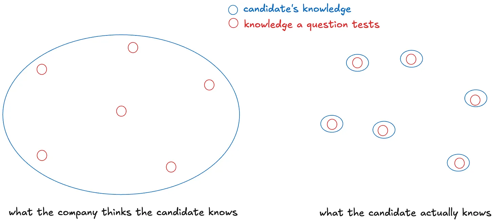

## Background

Here’s a quick summary on what’s been happening in the technical interview (in tech) space (skip it if you already know the story and want to jump straight into the commentary):

1. Technical interviews for junior software engineering roles in many companies involve solving “data structures and algorithms” (DSA) problems. The point of this (or at least, in the past) was to assess how well a candidate could apply algorithmic thinking to solve a problem and explain his / her solution.

2. There’s a platform called “LeetCode” (LC henceforth) which contains 3000+ such problems, which many people use to prepare for such interviews. The premium version also allows you to filter questions by the companies that have asked them in the past. Importantly, LC is not new. It’s been around for almost a decade.

3. A few months ago, 2 students from Columbia University built [InterviewCoder](https://www.interviewcoder.co/) — an AI app that interviewees can use to get solutions + step-by-step reasoning to LC-style questions problem in the interview itself as it goes undetected during screen-sharing. One of them used this during his own interviews for Amazon, Meta, etc. to pass the interviews, and then posted this on social media, which sparked massive debates.

4. Amazon, Meta, Capital One, etc. rescinded their offers when they found out that he had cheated in his interviews. Amazon even told Columbia University to take action against the student, and a few days ago, Columbia suspended him for a year.

5. Initially, the product he had built was free and open-source — free both in terms of cost as well as free to modify (i.e., [gratis as well as libre](https://en.wikipedia.org/wiki/Gratis_versus_libre)). But once the product became viral on social media, he monetized it by making it paid (and also, closed-source), charging $60/month.

## Commentary

The most common reactions I’ve seen on social media have been (all quotes are taken directly from LinkedIn / X):

1. “He wanted to make a point: these Leetcode, Hackerrank, and Codepen challenges are useless. What we need from a hire is to be a problem solver, not a human GenAI. Of course, we want a coder to know how to code, but we don’t necessarily need to go to crazy lengths to have someone prove their skills.“

2. “Cheating isn't right, but oh god I am so tired of these stupid algorithm interviews. At this point, with LeetCode company tags, AI being rampant, the effectiveness of algo interviews is questionable.”

3. “I (as an interviewer) am so annoyed by him but (as a candidate) also adore him.”

It seems like many people are hailing him as a hero for standing up against the “broken” system.

I want to dive a little deeper into what _exactly_ is broken here and why I think the current narrative around this is misleading.

### Frustration

I think most people would agree that LC is not a high-signal way to measure a software engineer’s ability to perform at the real job. I know many people who are great engineers but aren’t good at algorithmic problems, and vice-versa. In fact, this is the reason people are supporting him in the first place.

And so, they are frustrated when they have to “grind” LC in order to get a job, especially so when they know that it’s not going to be relevant to their job anyway.

So, there’s this palpable feeling of “we need to change the hiring process!!” in the tech community.

### Why not test “real” skills

The ideal scenario that would be to give a “real” task to the candidate and see how they solve it. It’s the most direct way of assessing how good they would be in their role.

Some examples are:

1. Take-home project to build an application with some specified features

2. An interview where candidates are given a codebase to understand and debug, or add some feature on top of the existing codebase.

But to do either of these requires more effort from both, the company’s side as well as the candidate’s side. It takes longer for the candidate to do the take-home project and for the company to actually read through the project and evaluate it. The same is true for longer interview processes, be it in terms of the number of interviews or the duration of each interview.

From a candidate’s point of view, if they apply to 100 companies and have to do 100 take-home projects (assume conservatively that each only takes 4 hours), that’s 400 hours worth of effort spent! In such a case, maybe candidates will stop doing the project unless they really want to be join the company. Either this can be a self-selecting criteria (if a candidate does the project, they are clearly interested) but it can also backfire (many talented candidates might not want to do the project if it’s going to take them too long).

I’ve noticed that the companies that _really_ want to hire the best talent (generally high-growth startups and quant firms) are willing to put in the effort to make their hiring process as “un-preparable” as possible to extract the most signal. They have more rounds on average, and their questions are less “standard” as compared to other companies.

In particular, even if they do have LC-style interviews, that is never their only source of signal. They often also have other kinds of interviews like:

1. Building an application that makes API calls to fetch some information and then analyzes that information

2. Building simple versions of some games / apps to see if you can structure you code in a nice way

3. Questions on low-level operating-systems and networking concepts

4. System design interviews

I think this has worked out pretty well for them (in the sense that these interviews seem to be high-signal) _precisely because they are among the few companies that have such interviews_. So, there haven’t been many resources created to “prepare” these kind of interviews and candidates haven’t been optimising as much for these kinds of interviews [^1].

Put simply, the tension can be described as follows: from a company’s point of view, an interview gives the highest signal (aka best predictor of success / failure) if the candidate cannot have prepared _specifically for the questions asked in this interview_; from a candidate’s point of view, an interview is easiest to pass if they can prepare well-in-advance specifically for the questions going to be asked.

Why is this so?

The case from the candidate’s point of view is obvious (and is left as an exercise to the reader xD) so let’s talk about the company’s point of view.

When they ask a bunch of questions, they’re not just testing whether you know those exact concepts but also related concepts in the domain. E.g. If they ask you to explain the difference between a clustered index and unclustered index, they don’t just care whether you know the answer to this question but they’re going to use this data point to estimate your knowledge of databases in general. It’s like randomly selecting a sample of questions to ask, and using that to predict the “overall knowledge in a domain”.

When candidates start over-optimising for specific questions / topics asked in interviews, this extrapolation / generalisation no longer works. A company cannot tell the difference between a candidate X who knows databases very well and someone who just learnt the difference between clustered and unclustered index (for the sake of this interview).

Companies expect the left, but might end up getting the right — someone who knows nothing beyond the questions asked in the interviews.

It all boils down to the same thing: the hiring process tests something that is a “compression” of your skills / knowledge, which can easily be measured against other candidates. And this compression is necessarily lossy because of time and effort constraints.

The only way for companies to keep the interviews un-preparable (aka un-grindable) is to keep changing their questions + interview process every now and then. I know of several companies that do this but it does take a lot of effort of planning [^2].

### Why is LC still used?

Full disclosure: I’m part of the group that has solved several hundreds of problems on LC while preparing for interviews, which means you could argue I’m biased towards keeping the current system intact since I’ve spent a lot of effort optimising for it. I’ve tried to correct for this potential bias and be more objective about my reasoning.

To get this out of the way: I think most companies _know_ that LC interviews are not the best way to assess a candidate’s software engineering skills. Yet, they still keep conducting them. Why?

In my opinion, the reasons why they still exist as a metric are:

1. It tests whether the candidate has the right “algorithmic thinking” aptitude. Solving LC questions essentially boils down to a form of pattern-matching on the various data structures / algorithms / approaches, and [I’d argue this is a kind of aptitude or intelligence too.](https://hsnaved.substack.com/p/intelligence-as-pattern-matching)

2. It tests whether the candidate has some basic level of coding skills.

3. It provides a standardised / streamlined way to assess candidates, regardless of their university and specialisations. DSA is taught in nearly all universities across the world so it’s kind of like a “standardised test” to assess candidates without making any other assumptions about the candidate (e.g. they could be specialising in databases or frontend or networking and they’ll all still have learnt this). And there’s also a pretty “standard” way to _assess_ how well a candidate did in such an interview, by looking at the optimality of their solution (i.e., time and space complexity), and how well they communicated their thought-process and solution to the interviewer (slightly more subjective but it’s probably easy to come up with a checklist / rubric for this too).

4. It’s cost-effective and time-effective from the company’s point of view.

I guess the counter-argument is that most software engineers _don’t_ use fancy data structures and algorithms in their day-to-day jobs. They don’t need to know how to invert a binary tree or find an eulerian circuit in a graph to perform their role. I agree.

I think if, as a candidate, you know what domain you’re interested in (e.g. databases, frontend, infrastructure, etc.), and are only applying for those roles, it’s frustrating to have to do LC to land a role which has very little relation to it. You would much rather have role-specific questions and get better in that specific domain.

But if you are a candidate who is applying for internships / junior dev positions in different domains (frontend, backend, infrastructure, etc.) because you’re still not sure what you’re interested in (i.e., still in exploration mode), having LC-style interviews is actually in your favour because instead of preparing for 10 different kinds of interviews for 10 different roles, you only need to get good at LC to pass interviews for any role [^3].

There’s pros and cons on both sides.

This brings us to:

### Goodhart’s law

> When a measure becomes a target, it ceases to be a good measure.

Right now, the measure used by many companies is the ability to solve LC questions. So, it’s natural for candidates to solve many LC problems (aka grind) to prepare and good at it. _This kind of grinding is inevitable in any system where the benefits are worth the effort. It’s not unique to hiring or tech._

(Note: This is not the same as cheating because you’re not doing anything that is not allowed under the rules of the system, and you’re not lying about it. Preparation does not amount to cheating _precisely because it’s done beforehand_, before you even knew what questions you were going to be asked. Exception: if your interviewer asks you if you’ve seen the question before and you lie and say “no”, then it is considered cheating.)

When some companies moved to asking system design questions, tons of resources came up on how to “crack” the system design interviews too.

This law basically means that we will never have a perfect solution to the problem of hiring. _Anything companies start to measure will lose signal as soon as candidates realise that companies measure it._

So, the companies have to figure out what skills are they really looking for.

Maybe it’s worth letting students optimise for building a “portfolio of projects” if it means they learn something relevant in the process? I think so.

Then interviews can be project deep-dive sessions where companies ask candidates to talk about their projects and dig deeper into the technical challenges involved in building it, which tests real understanding. This would require more effort from both sides but it’d definitely improve the quality of the hiring process.

By Goodhart’s law, we can expect tutorials on youtube that guide you through building a project you could talk about to become popular and candidates to specifically create projects for the sake of talking about them in interviews. _If something can be grinded, people will grind for it._

So, this would naturally reduce the signal of such interviews too. The onus would then be on the interviewers to be able to detect whether the candidate really understands something by asking more probing questions. (Well, until someone builds an InterviewCoder-but-for-Project-Deepdives and we’ll have to find a new process all over again.)

To reiterate, I’m not saying that we should _not_ change the interview process. I’m just weighing the costs and benefits, and claiming that it’s going to be hard to come up with a new, scalable process that companies can adopt — one that doesn’t have the same downsides as the current one.

### The Elephant in the Room

Is it, um, “right” — ethically and morally — to cheat in interviews??

You probably already have your own views on this based on your values and philosophical beliefs, and if you disagree with me here (which is perfectly alright btw!), I think it’s unlikely I’m going to be able to change your opinion.

But still, here’s a quick rundown of my take on the ethics of this:

Generally speaking, breaking rules is wrong, but of course there are exceptions. For example, speeding on an empty highway to rush someone to the hospital is still “breaking the rules” but I doubt anyone would argue it’s morally wrong.

Some relevant factors affecting the morality of breaking rules would be:

1. Is there some “injustice” going on that you’re standing up against by breaking the rules?

2. Does this personally benefit you or are you doing it selflessly for the good of others? (That is, what are your intentions behind your actions?)

    Note: “Morality points” are not the same as “utility points”. If a rich man and a poor man both donate $10 to charity, both get the same utility points but the poor man gets more morality points. Similarly, if you do something with the intention to serve your own interest but it ends up having a net positive effect, you get utility points but no moral points.

3. Does it harm anyone? (If so, you need a much stronger reason to justify it.)

In this case, just saying “cheating is bad” is kind of a weak argument. Let me try to strengthen that:

1. It shows a lack of integrity — there is an implied (if not express) agreement that you will not cheat when you take such assessments or interviews.

2. It does cause harm to others — not just the company but to other potentially more qualified candidates who decided not to cheat.

3. I think this is like cheating in any other exam (think: university exams, or admission exams) simply because you think exams are useless and don’t test your real understanding of the topic. You cannot justify cheating because you don’t _want_ to spend time studying for it — that sounds like an excuse for laziness.

4. I think he lost any moral points he had when he monetized the product (for $60/month!!) — his motive shifted from fighting against the system for the greater good, but to profit from it himself. (If it were free and open-source, many more people would use it and so it becomes easier to overthrow the system, if that indeed was his goal).

5. Oh and based on [his recent LinkedIn post](https://www.linkedin.com/posts/roy-lee-goat_i-just-got-kicked-out-of-columbia-for-taking-activity-7310834407433453568-tqAm?utm_source=share&utm_medium=member_desktop&rcm=ACoAADOXW3UBEGhPoD4NzqGmySaduJSx-Ra60zU), his intention _from the very beginning_ was always to create a startup and make money. All this was just a means to go viral and promote his product, which worked remarkably well.

    In his own words: “In Fall 2024, I transferred into Columbia as a CS major. I came in knowing I wanted to start a company… So we flipped the usual startup model on its head and decided to just build something we knew would go viral first, focusing on distribution before anything…. The plan was to use it ourselves, get offers from top companies, film everything, and ride the shock factor.”

    _Importantly, his primary motivation behind building this was never to change the system but to go viral and make money._ [^4]

6. Lastly, I don’t believe there’s any “unfairness“ in the system right now — at best, the argument that can be made is that it’s a _suboptimal_ hiring process, but that does not take away from the _fairness_ of it [^5]. Right now, minus the cheating, everyone has equal opportunity. No one is stopping anyone from solving more LC problems too. And it’s all fair game. It’s within the rules of the game.In my opinion, it’s more important for a process to have integrity and be fair than anything else. I don’t really care what the metric is as long as it’s something mostly within a person’s control (i.e., you can good at it if you work hard enough). In this regard, LC is a fair metric since people can definitely get better at it with practice [^6].

   Can I also just say that being anti-leetcode and still not condoning cheating is a perfectly reasonable stance? Like, being anti-leetcode doesn’t automatically mean you need to support cheating.

Anyway, I think some amount of luck / randomness in the process is inevitable (and should be accepted) due to the sheer scale of hiring for interns / junior positions — for example, factors like how you early you apply, variability in interviewers, variability in questions asked in the interview, etc. do affect the final outcome. So, there will be some people who feel it’s unfair to them purely due to bad luck, and that’s unfortunately the hard truth.

(Tangentially, even though I don’t respect his business model, I have immense respect for the sheer chutzpah and conviction he has to do be doing all this, despite people (myself included) saying it’s not right and Columbia University suspending him. It takes guts, at the very least.)

### Possible Outcomes

Okay, so now what?

What’s going to happen, given that all this drama is taking place in public and companies are aware of the existence of such AI tools being used to cheat in their interviews? This is the part I’m more interested in.

Here’s my rough sense:

1. **In-person interviews**: More and more companies will start to adopt in-person interviews as the final round to prevent cheating. This is already very common in Singapore (since it’s a very small country, it’s reasonable to ask candidates to travel to office for an interview) and I expect the proportion of companies doing this to go up even more.

2. **Tighter filtering criteria**: Right now, many companies don’t care about GPA or which university you go to when hiring for internships. This is because they feel interviews and online assessments give better signal than examinations in university. But if more people start cheating, it might make more sense for companies to filter students by GPA / which university they went too, as some factors. Why?Because it at least establishes some baseline level of aptitude / skills. It’s reasonable to expect that average student from MIT/Stanford/CMU is probably better than the average student from \<Insert another university\>. So, by having tighter filtering criteria, companies reduce their variance of a new hire, and at least know the person is decently good.And since typically, companies want to minimize their false positive rates more than they want to minimize their false negative rate, this makes sense. That is, the cost of a bad hire is often much higher than the cost of missing out on a good candidate.

3. **Software v Software (2025)**: It’s also possible that companies start using software that can detect currently-invisible-AI-applications. I’m confident that this is not too hard because software like Examplify already exists for examinations (it can block network activity so you cannot access the internet). Once the software has kernel-level access, it can basically track / monitor / block whatever you want.I’m also pretty sure people are already working on [building this](https://www.linkedin.com/posts/ugcPost-7311482014581374976-2wRU?utm_source=share&utm_medium=member_desktop&rcm=ACoAADOXW3UBEGhPoD4NzqGmySaduJSx-Ra60zU). It’s going to be a cat and mouse chase as the cheating-platform-creators try to find workarounds to this and proctoring-software-creators try to patch them. I expect this to be the most common path companies take to combat such cheating.

4. **Blacklisting**: Maybeee if a company detects (with sufficient evidence / reason) a candidate cheating, they can consider blacklisting them [^7]. I honestly think this would be a huge deterrence against cheating as it increases the “cost” of cheating drastically. Then, the only people for whom cheating would still be “rational” [^8] would be the people who have a close-to-zero chance of passing the interview to begin with — and these will be easy to spot once they start working.

5. **Removing leetcode-style assessments**: My estimate of the probability of this happening in the near-future is quite low. Moreover, whatever replaces this is going to face similar problems too, because cheating is not something unique to leetcode-style interviews. Cheating is possible in any system and needs to be detected and discouraged.

6. **Unpreparable Interviews**: Again, I think very few companies are actually going to put in the effort to change their hiring process / type of questions asked in interviews every couple of years to make them less grind-able. But according to me, this is the most robust way companies can guarantee to get high-signal from the interviews and assessments and minimize any false positives.

---

Footnotes:

[^1]: If more companies start moving to X type of interview, then it incentivizes more candidates to start preparing for X as they can kill many birds (here, pass many interviews) with one stone (here, preparing one thing - X).

[^2]: I’m sure it’s worth it if you’re trying to hire the best people.

[^3]: Though an argument could be made that you’d learn a lot more by studying 10 different domains than just doing LC. I agree 100%.

[^4]: I have nothing against making money or entrepreneurship! I’m 100% for it (as anyone who knows me can vouch for). I just happen to place values and ethics above entrepreneurship.

[^5]: So, while there may be a need to improve the system from an optimality / signal-seeking-process standpoint (not from a fairness standpoint), this would not justify cheating. You can believe that LC is not effective yet not support cheating! Rather, the means to do that would be to come up with a robust alternative and show that it’s better than the current system. I’d argue big tech companies are well-positioned to do some kind of A/B testing of different hiring processes to figure out which one works best — something I would definitely support!

[^6]: Part of me believes that the non-grinders will always feel like the system is not fair towards them because they think it’s rewarding the “wrong” people, no matter what the metric is.

[^7]: I’m not entirely sure if the punishment is proportional to the transgression here — it’s possible this is a little too extreme.

[^8]: In EV terms, E[cheating] = (1 - P(get caught)) * (benefit) + P(get caught) * (consequences). Companies can influence both, P(get caught) and the consequences too, to make it irrational for anyone to try cheating. More generally, changing the incentives in a system can have a HUGE impact on the behaviour of actors in a system.
