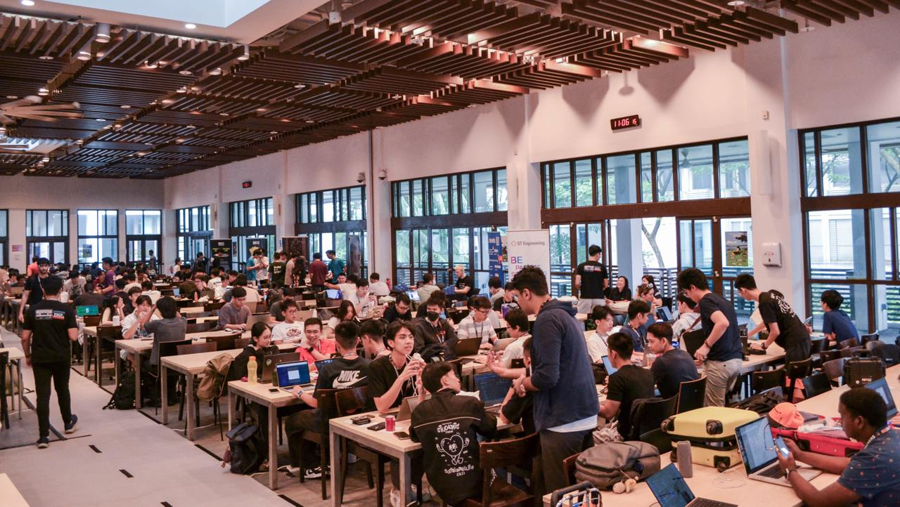
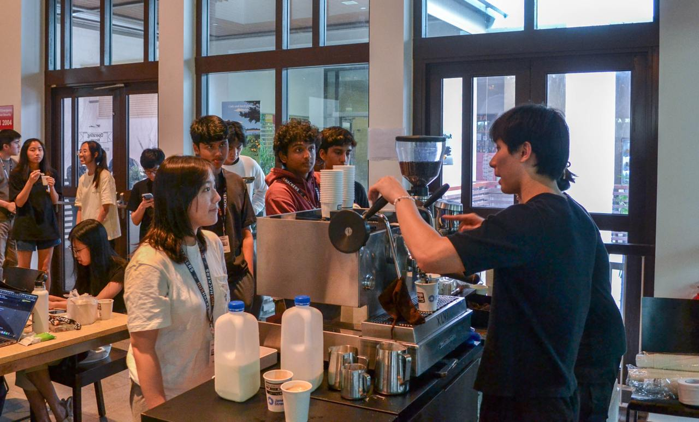
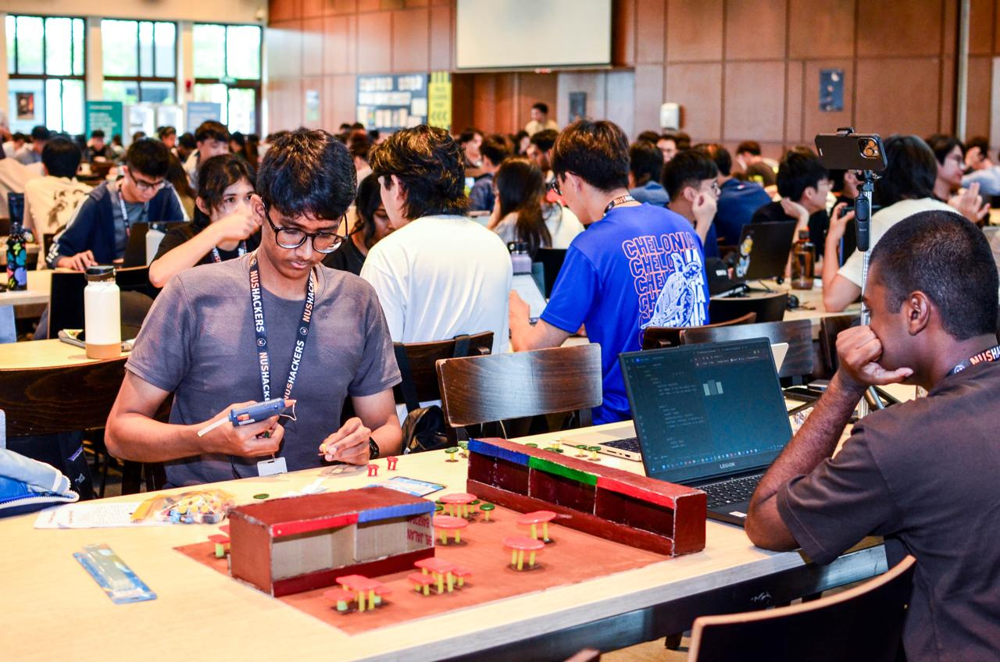
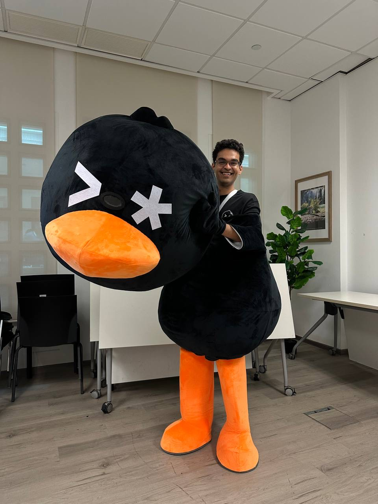
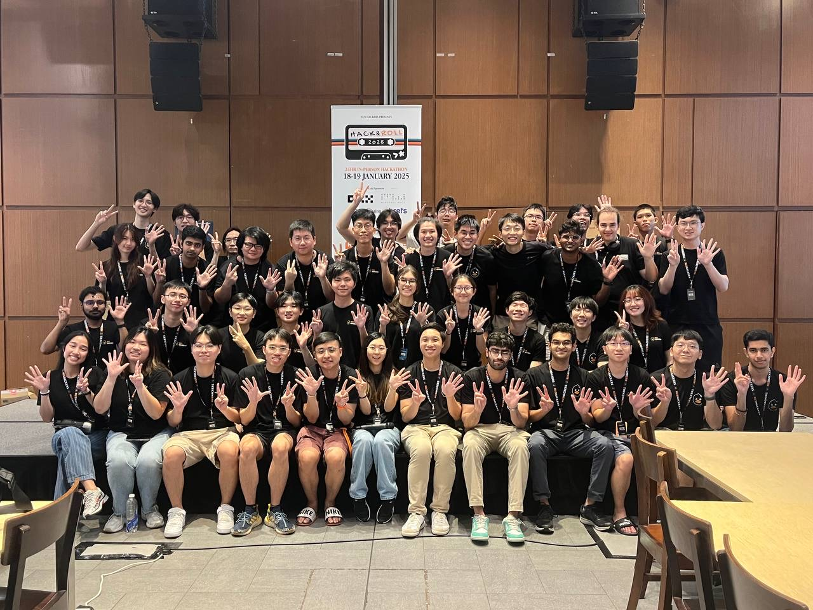

I don't usually post about events, but this one was special: Hack&Roll 2025!

Hack&Rolls have been a big yearly affair for the past 4 years of my life. I took part in H&R 2021 as participant, and organized the next 3 iterations (2022-25).

For context, Hack&Roll is the largest student-led hackathon in Singapore, held in-person over 24 hours (meaning you can stay overnight), and open to all students (from primary school to PhD). What makes it unique (apart from the free flow of coffee + snacks + food) is that there is no "problem statement": you are free to build whatever you want. Even the criteria for judging is really just how cool your hack is.

We have ~10 spot prizes (aka categories) that you can qualify for (e.g. "most annoying hack", "most beautiful hack", "most awesomely useless hack", etc.) depending on what you're building.

The purpose of Hack&Roll is to encourage you to explore your creativity, learn something new, and just build something you're proud of. This is what hacker culture is all about.

This year's hackathon was held last week (18-19 Jan), and we broke all previous records:

- 747(!) participants (we had students from secondary schools, junior colleges, polytechnics, NSFs and university students)

- 270(!!) teams (meaning 270 projects were built over the span of 24 hours)

- 121(!!!) judges (all our judges are either industry professionals or professors or indie hackers)

We put in a lot of hard work into organising Hack&Roll every year, and it's always worth it. It's so cool and inspiring to see the participants build such amazing hacks.

I also just really enjoy organizing events and handling the operational / logistics aspect of things. It seems like a weird interest at first glance but I think it's because this require a certain kind of imagination (to predict and visualize exactly how something is going to happen), creativity (to solve problems related to physical constraints like time, space, etc.) and the raw ability to get things done.

There were lots of fun moments, like wearing the mascot - yes, I can finally reveal it was me [^1] since I won't be wearing it anymore - and playing mario kart in the ops room.

And there were also some, um, stressful times - like when my "efficient table allocation" script (that I had never tested until that moment) failed an hour before judging started and we thought we'd have to switch to our backup plan [^2] (nah, I ended up fixing it and we got everyone in a single hall for judging), or when I was live-debugging the `winners.py` script to determine the winners of the hackathon in front of ~1000 people (turned out to be some random pandas datatype errors which caused the closing ceremony to be delayed by 10 mins, sorry!).

But honestly? I enjoyed every single moment, and wouldn't have it any other way.

And organizing large-scale events such as these has taught me so much about planning, managing, operations, leadership, teamwork - things that can't be taught in a classroom. Nothing prepares like the experience itself.

It's probably the last hackathon I'll be organizing for a while since I'm graduating in a few months. I'm going to miss this.

Here are some pictures to show just how vibrant and energetic the atmosphere was:

<figure>

<figcaption>Hundreds of hackers building the next big thing.</figcaption>

</figure>

<figure>

<figcaption>Code, Coffee, Chaos.</figcaption>

</figure>

<figure>

<figcaption>Teams building actual physical prototypes.</figcaption>

</figure>

<figure>

<figcaption>Me wearing the mascot for the last time.</figcaption>

</figure>

<figure>

<figcaption>All organisers: coreteam members + volunteers.</figcaption>

</figure>

---

[^1]: some of the time* (this year, we had 2 other people who also wore the mascot at different times)

[^2]: the backup plan was to use 2 halls for judging, if a single hall could not accommodate everyone, but i thought this would be much less vibey (and less like a project fair) and so, we just had a more optimized table-allocation system (to pack everyone in 1 hall).
