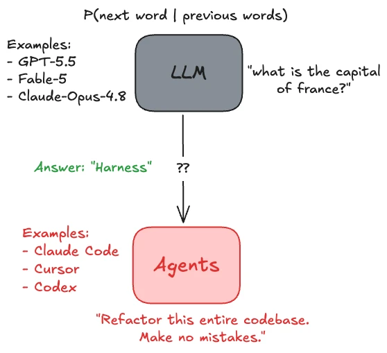
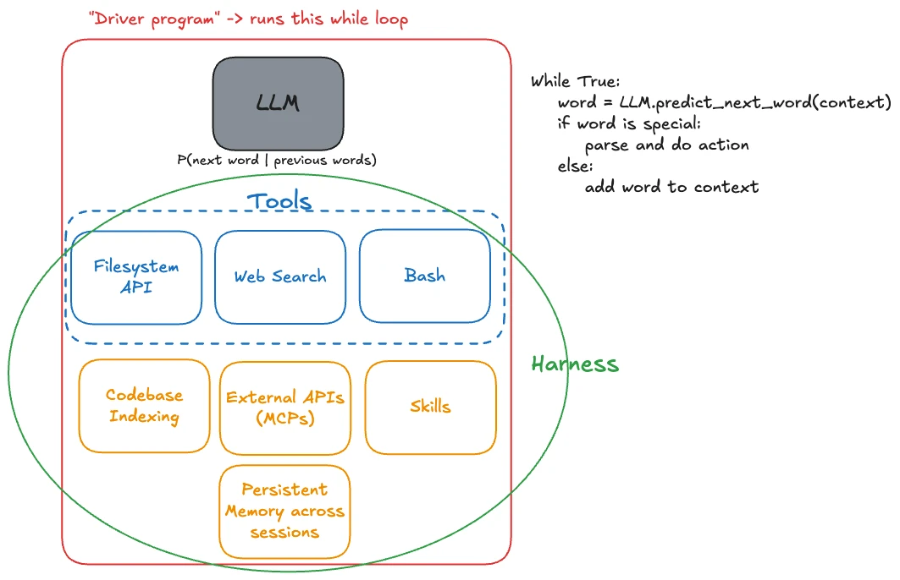
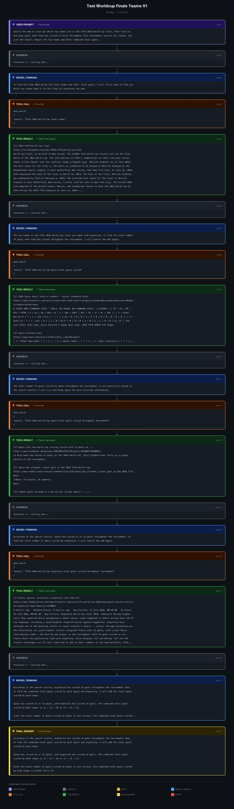
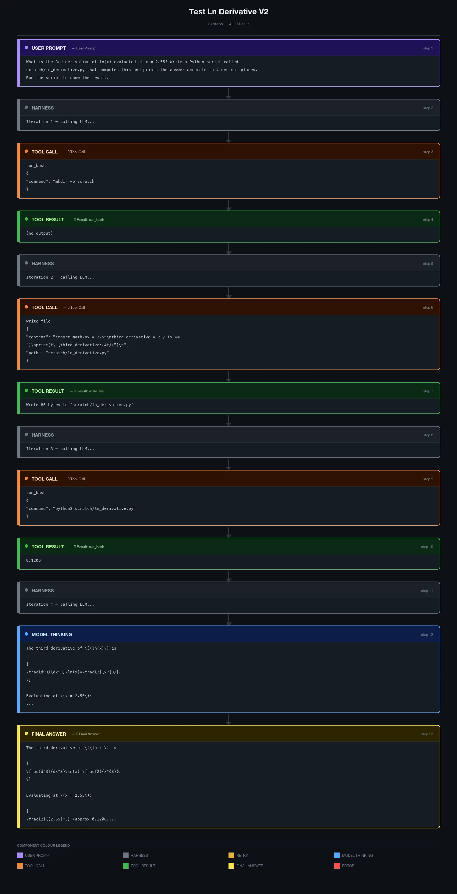

Over the weekend, I had a sudden burst of inspiration to try and understand the one piece of software I now use more than anything else : more than a web browser, more than slack or outlook, more than social media.

Claude code.[^1]

I wanted to demystify how agents work. And since the best way I know how to learn something is to build it yourself, I decided to try building a simplified version of it.

Turns out its ridiculously simple.*

(*Caveat which I’ll address later.)

This was roughly my mental model before I started the project:



An LLM is just a model that outputs / predicts the next word, given some context of previous words. For the purposes of this project I was happy treating this as a black-box, I wasn’t going to implement an LLM from scratch (having already done something similar once before).

An agent is a “thing” (software? robot?? semi-conscious being??? jk jk /s) that can DO things. It can take actions - e.g. search the web for information, edit and create files, send emails, make restaurant reservations, etc. - that influence the “outside world”.

And my goal was to build the harness to turn an LLM into an agent. In fact, that’s kind of how I would define a “harness” : LLM + Harness → Agent.

### version 1

I envisioned the harness as a simple loop:

1. While True:
   1. token = LLM.generate_new_token(context)
   2. if token is a special token
      1. do some special action
   3. add token back to context

The first thing I needed to build was to allow the LLM to call tools.

So I decided to implement just 3 tools to begin with:

1. Web search → first tried using duck-duck-go but it was too unreliable so switched over to "Tavily”, a search API built specially for agents.
2. Filesystem API → reading, writing and appending to files.
3. Bash commands → whitelisted some useful commands for the LLM to “call”, e.g. `grep`, `python3`, `curl`, `head`, `tail`, etc.

While it seems like a minimal set of tools, an LLM can already use these to write and execute python code, based on some information from the web.

These tools were just wrappers around the actual commands I would run under the hood, making it easy for the model to invoke them.

> Btw this project was entirely free: I used Groq as the open-source LLM provider, and Tavily’s free tier for web search. Everything else was just plain old code running on my laptop without any external dependencies.

Which brings us to the most elegant part of the project. How would an LLM call this function or tool?

I knew that most modern LLM-providers supported tool calls natively but I didn’t want to use them yet - I wanted to actually do it _from scratch_.

I decided to just have it output this:

```
<tool_call>{{"name": "tool_name", "args": {{"param": "value"}}}}</tool_call>
```

whenever it wanted to call a tool.

For example, if the LLM wants to query the web, it’s going to produce this following piece of text:

```
<tool_call>{{”name”: “web_search”, “args”: {{”query”: “Reviews of Odyssey”}}}}</tool_call>
```

The key point (and beauty!) is that the LLM is still just producing text!! It’s not DOING anything. It’s still just: text in, text out.

**The only difference is that we’re** ***interpreting*** **the output of the model differently, not merely as text, but as instructions to take action.** And this is happening outside the LLM. This program which “runs” the LLM on a loop is often called the “driver” program.



Seen through this lens, it becomes exceedingly clear that the harness is “just”[^2] glue code - it is providing capability to the model by exposing simple APIs for the model to use and then calling those functions underneath the hood.

Okay but how does the model even know these tool calls exist?

Again, the naive solution is so stupidly simple and yet it’s surprising it works at all: just add it to the system prompt so that before each conversation, the LLM knows what tools it has…

Here’s an example of the complete sequence of steps that takes place:


Hm rip it believed that Argentina has scored 14 goals - its actually 19. Great example of why you need more guard-rails when using agents - the search result was wrong!

So basically:

1. Tell the model what to output to be treated differently as “actions”
2. Actually implement the actions outside the LLM in code
3. Pray the model learns to output the actions it wants to use correctly.**
4. When the model outputs the action-word, just parse it and call your defined functions.
5. Add the return value of this tool / function to the context before calling the LLM again

Step 3 is the reason the reason this solution is “naive”, which brings us to…

### version 2

While I thought version 1 was “pure” in that we were using literally just an LLM and parsing the text ourselves, it led to a lot of issues.

The key issue was hallucination of tool call results.

Since we would pass in the available tool calls in the system prompt, and the model was trained to predict the next word / complete the sequence, it would often just “predict” the result of the tool call, without having ever called the tool.

For example:

1. System Prompt: “Hey you have these tools available to be used in this format <tool_call{”name”: “tool_name”, “args”: {{”param”: “value”}}}}</tool_call> and the actual tools you have available are as follows:”
2. Model: “<tool_result>…”

This was bad because it’s just auto-completing the pattern instead of actually using the available tools.

There was also nothing “enforcing” that the LLM respected our format / protocol of using tools, besides the fact that we asked it to. It was all too fragile and kept breaking.

So, I decided to try using native tool call support in the models.

What this meant is that you would just pass in the available tools as a parameter and then it was the model provider’s job to make sure the LLM outputs a valid tool call whenever it wanted to. The reason it’s better is because they have post-trained the model to follow the format of the tool calls - which means the actual weights contain that information somewhere, not just as words in the system prompt - and they probably also constrain the grammar when sampling tokens to ensure it follows specific formats (e.g. key of a JSON must be a string).

And it worked much better - not as many hallucinations and it was obeying tool calls reliably.

Example:



### further improvements

There’s tons of more work that can be done to give the LLM more features, improve how it performs, improve performance, etc.

Some examples include:

1. External MCPs - these are just like tool calls, just not defined by you, that the model can run. If the model wants to make an external MCP tool call, you can just transform (if needed) and forward it to the external application (e.g. outlook, slack, etc.) that is providing this MCP.
2. Skills: each skill just maps to a text file - when you see the skill in the prompt, just replace it with the entire text file +/- maybe some extra tokens around it to indicate that this skill had been invoked.
3. Persistent memory across session: just store it as text files that the model can access later from future sessions.
4. Specifically for programming tasks, it’s more effective + efficient to have a codebase index (with dependency graphs, vector embeddings for functions / classes) that the LLM queries instead of letting it run arbitrary bash commands like `grep` to find what it needs to.

Also, I know I said earlier it’s ridiculously simple to build an agent harness. I should’ve rephrased it to “it’s ridiculously simple to get a working + functioning prototype of this but building a _good_ harness actually takes incredible engineering and research work.”

Example: if you let your model just `curl` arbitrary pages for information, it’s going to get overloaded with all the unnecessary CSS and JS rather than the actual content of the page, so it’s probably more effective to filter for the body and even truncate part of that. Or have another subagent summarize the body of the HTML page and then only pass the summary directly. (Tavily already provides a “summary answer” but I thought that would be cheating so didn’t use it.)

As with almost any non-trivial piece of software (or work in general), there’re so many minute details and nuances that you have to consider and work around when building something. In this specific case, for example, there’s tons of optimisations you can do - e.g. supporting spawning sub-agents to delegate work, parallel tool calls, caching cleverly, etc. - to improve the performance of the harness.

But the key takeaway from this is probably just that an agent is a (black-box) LLM surrounded by completely deterministic pieces of software that are not complicated to understand. The mystery lies only inside the model; everything outside it is just good old-fashioned engineering.

Anyhoo, that’s it for now :)

[^1]: funnily enough I’ve been dabbling around with Cursor’s CLI more and more since then but I’ll continue using Claude as the primary example since it’s become the verb-replacement for all “agentic stuff”, like how Google is the verb-replacement for search engines. E.g. “I’m going to _claude_ this entire feature” is now a thing, just like “I’m going to _google_ it” has been a thing. “I’m going to _cursor_ this entire feature” just doesn’t have the same ring in it.

[^2]: “just” in quotes because as everyone will tell you, glue code can be extremely complicated and often the “main” thing. stitching together multiple components to talk to each other seamlessly is hard, not just in software but also in the real world.
