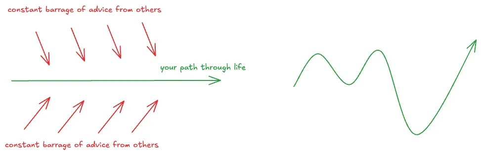
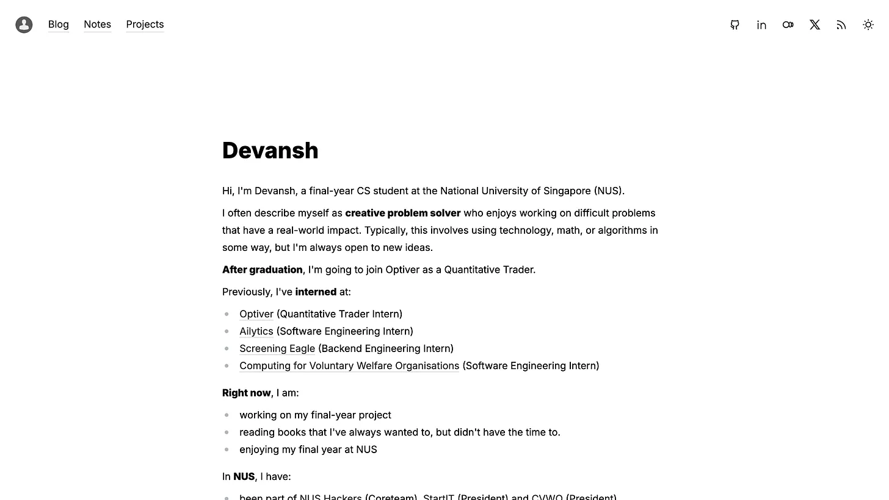
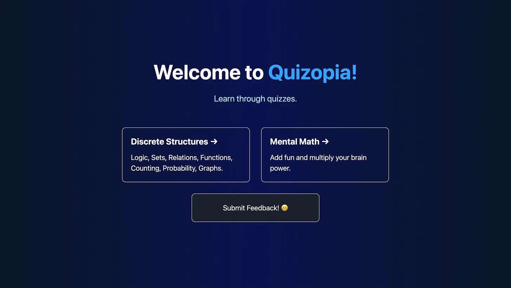
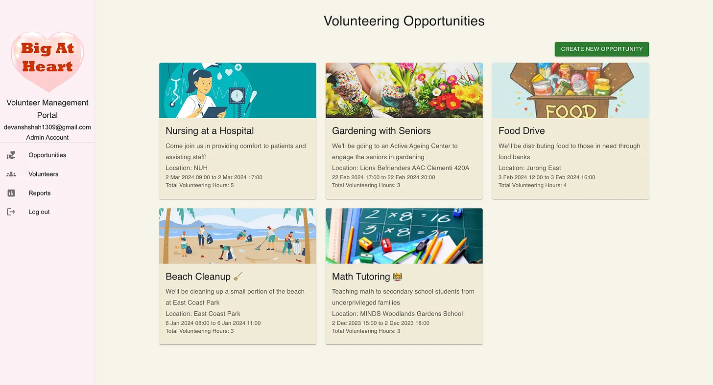
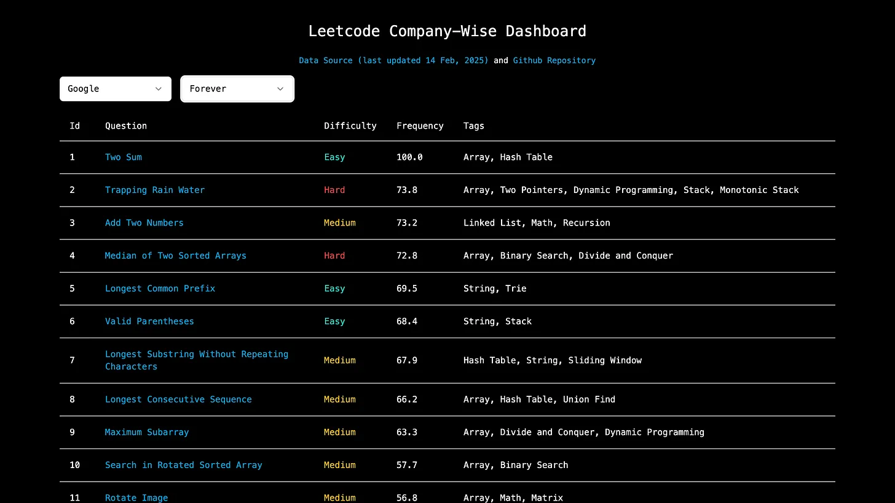

*Estimated reading time: 19 mins*

To me, being happy and being productive are two sides of the same coin. When I’m happy, I tend to also be more productive, and being productive also brings me joy.

I’ve been experimenting with many different systems over the past few years, and have tried following a lot of the common advice in books and videos. For example, keeping my phone away in a different room while doing work, or waking up without an alarm clock.

Some have worked, others haven’t.

I think I’ve come up with some of the main changes that have really moved the needle in terms of making me happier and also more productive [^1].

None of these are groundbreaking, or even original, ideas. Instead, they’re some of those simple-to-preach-but-hard-to-practice (e.g. “eat healthy and exercise”) ideas that I’ve become convinced are _actually_ important by seeing them in action in my own life.[^2]

As an obvious disclaimer: These are just things that have worked for me, I don’t know if they’ll work for you. But it probably doesn’t hurt to try them anyway right?

### 1\. Don’t waste time

I hate the feeling of wasting time. I think it’s a pretty common feeling among people I’ve encountered.

But everyone has their own definition what "wasting time" means to them. Which is why I think a more useful meta-definition which doesn’t talk about any specific activities but is instead about how to identify “time-wasting” activities is:

> If doing X doesn't add value in any way AND makes me feel worse _afterwards_ , then X is a waste of time.

The idea is that you CAN do things that to relax and enjoy yourself even if they don’t add any productive value, as long as you genuinely feel good afterwards. For example, going for a walk, meeting friends, etc.

The activities that I consider a waste of time are ones that I only enjoy in the moment and _I know_ will make me feel worse about it later on. For example, watching random youtube videos about things I don’t remember a day later, scrolling through Instagram reels.

You might consider _different_ activities a waste of time (or not) and that’s alright. I think as long as you’re doing things that are either adding some value / helping you make progress or making you happier, that’s perfectly fine!

What’s important to me is that I want to be in control of where and how I’m spending MY time (and to do this, I need to be able to track, at some high level, what I’m doing with my time).

So, rather than just jumping straight into doing something, I find it useful to pause for a second and ask “Why am I doing this?”. I do this for literally everything now.

If I don’t have a good reason for doing it, I realise I shouldn’t be doing it.

(To reiterate, what counts as a good reason depends on you; for me, “just out of curiosity” is a good reason, but “because I’m bored” is generally not - more on this next.)

### 2\. Setting the right defaults

It’s [pretty](https://en.wikipedia.org/wiki/Psychological_inertia) [well-understood](https://en.wikipedia.org/wiki/Default_effect) now that defaults have a big impact on our decision-making.

For small decisions, we often tend to just follow the path of least resistance / effort rather than actually thinking and trying to find the best course of action. e.g. What to eat for breakfast?

The problem is that although each individual decision can be inconsequential, they add up over time. What you eat for breakfast everyday for a decade can have a pretty big impact on your overall heath.

Perhaps the biggest “default” that exists in most our lives is our default source of entertainment. What do you do when you’re bored?

Every time I was bored, I would just mindlessly grasp my phone and open either Instagram / X to see something new and get a quick dopamine hit. I didn’t have a reason for doing it. I just didn’t know what else to do.

An interesting realisation is that you can’t just remove this default option without replacing it with something else. That is, you can’t have no default. Otherwise, you still won’t know what to do when the situation arises and you’ll likely gravitate towards the option which provides the most immediate gratification (which is almost always the worst one in the long-term).

So, the way to “fix” this is to design your environment / system such that doing the right / good thing (that you know is better for you in the long-term) is the easier option.

Concretely, setting the right defaults for myself means that now, when I’m bored, I do one of:

  1. Watching videos I had added to my watch-later on Youtube (generally science / math / tech related).

  2. Listening to saved podcasts / audiobooks on Spotify.

  3. Continue reading a book.

  4. Go for a walk.

Observe that (1), (2) and (3) have some sort of prior planning - I curate the stuff I want to watch / listen to beforehand so it’s as easy as possible (since I don’t have to search for new content) for me to do it when I’m bored. And I always have a book I’m currently reading as another default option to continue — starting a new book would be much more difficult to adopt as there’s more friction involved in picking which book to start, obtaining it, etc.

Oh, and I often just delete Instagram / X if I find the temptation too hard to resist. And then install them back if I want to use them — this intentionally creates friction, which means I only use them when I really want to, not just because I’m bored and have nothing else to do. I don’t want them to be my default go-to source of entertainment.

Doing this also meant I regained control of how I was spending my “free” time, which ties back to (1) Don’t waste time.

### 3\. Listen to yourself

It’s easy to get sucked into a rabbit hole of constantly listening to other people’s advice and what works for them. This is exacerbated by the fact that every semi-successful person has started to give advice on social media and make youtube videos on how to be as successful as them.

Everyone is telling you what you should be doing, what you can achieve if you follow their advice, “If I can do this, you can do it too!”, blah blah blah.

It’s too much noise.

You feel as if you’re drowning in a sea of everyone else’s opinions.

The only lifeboat you have is to think independently and come up with your own opinions.

It’s a relatively new phenomenon where every person has been given a platform to share their ideas and give advice to others. It’s tempting to view them as “experts” based on how confident they sound — but in my personal experience, most of them are charlatans who do this merely for ad revenue, affiliate marketing, etc.

But more importantly, they don’t know you. They don’t know your context, your priorities, your goals, what you want to achieve, how you think. They know nothing about you as an individual. Why, then, do you think they know what’s best / right for you?

When you are constantly listening and following others’ advice, you’re not listening to yourself. You aren’t exploring your interests. You aren’t trying out new things that go against the social norms and conventions. You’re living life based on other people's expectations and opinions — sure, it might turn out okay, but you miss out on figuring out your passions, and your dreams.

And it’s not just explicit advice given by people. It’s also implicit in social norms and conversations. There’s this one standard path that everyone follows, and you feel the pressure to conform to it. In university, it might be: 1) study hard, 2) do internships, 3) find a job.

If you have different goals, you’ll feel out of place. You’ll feel as if you’re doing something wrong but at least you’ll know what you’re doing.

But if you don’t have any idea what you’re doing, you’ll likely just follow this standard path too. Without ever questioning if this is something you actually want to be doing in the first place. And this is dangerous.

I’ve felt this to be true personally as well. When I entered university, I didn’t know what I wanted to do but I just followed the default script in university. I didn’t really even think of what I wanted to be doing. I was too busy doing what everyone around me was doing. It was only in my 3rd year that I started questioning why I was even doing certain things. I went back to the basics — I knew I enjoyed tech and building things. So, I started doing more of that. I knew I liked math and statistics, so I started taking more of those courses. I stopped caring about what others were doing and started caring about what I was doing.

In my final semester, I’m even doing a business law course! Why? Just because I thought it would be fun. And it has been my favourite course this entire semester.

I feel like listening to advice is great _as long as you don’t blindly accept and follow it_. Think about it yourself. See if that’s what you want to do. Throw away the default script. Make one for yourself.

In fact, if you don’t already know what you want to do, trying to find your passion is a great source of joy in itself. The only way to know is to try different things and see what you enjoy — what feels like fun to you but work to others. Believe me, it’s worth it. Once you find your passion, it’s like an unlimited source of energy that you can consistently tap on.

### 4. Importance of Mood

The whole premise of this post is that joy boosts productivity and productivity brings joy.

More generally, I’ve found a strong (positive) correlation between my mood and my productivity. And my overall mood for the day is largely determined by how my morning goes. So, the natural question was: How do I consistently start my day in a good mood? Or, how do I get off to a productivity start so that my entire day goes well and as a result, my mood is also good?

I make no promises that this will work for you, but the thing that helped me achieve this was having a consistent morning routine. I like to start my day off slow and relaxed rather than jump straight into work. So, I wake up ~6:30am almost every day, go to the gym or for a run, and then come back and eat a nice, slow breakfast for 20-30 mins (even if I’m just drinking coffee, I’ll spend more time than “needed”, just enjoying each sip). All this brings my focus to the present and I appreciate it more.[^3]

(Oh, and I do think _not_ checking messages / emails until after breakfast is a key part of the routine. It’s precisely what makes it relaxing and distraction-free.)

I’ve also started spending more time outdoors and that has brought tremendous joy too. I touched grass more times in the last month than in the previous 4 years combined. And it feels great.

I’m pretty sure there’ll be equally (if not more) happy and productive people who do the exact opposite too. Which just goes to show that you have to figure out what works for you — though I do think having any routine is a game-changer.

Even a 5-10% improvement in your mood is going to have a tremendous impact on your quality of life, and it’s totally worth spending an extra half-hour or hour each day if it means you’re happier overall.

### 5\. Importance of Inspiration

Inspiration is an emotion. It’s this intense, yet calming, feeling that makes you think you can do anything you put your mind to, and _you_ can change the world too.

Inspiration often strikes without warning. You might be inspired by watching some youtube video, by reading a book, or just talking to someone.

Most often in my life, it has manifested itself as a “Wow, I have this amazing idea! I want to work on it right now!”

In the past, I used to try and delay it by telling myself that I had a lot of other assignments to complete, and work to finish, and that this “amazing idea” had to wait a while and take a backseat. I realised this was not the right way to prioritise things because inspiration is perishable.

You can’t force yourself to be inspired / excited about an idea you had a month ago — it fizzles away over time.

You can’t schedule inspiration. Worse, if you keep suppressing inspiration by not giving it its rightful time and expression, it might dry out entirely.

You need to have some “damn, this is so cool!’ moments every once in a while to regain this child-like awe and sense of wonder — and this only happens when you follow your natural curiosity.

Since then, I’ve decide to prioritise inspiration over anything that is not super urgent. For example, last month I had an idea to build a dashboard for company-wise Leetcode questions so anyone can access it _without purchasing Leetcode premium_. I spent a few hours on that very same day and just built it. I had originally planned to work on my final year project but that plan went out the window.

It was so much more fun, and I don’t regret it at all. I felt great that day. (And I got my FYP work done the next day.)

Also, I think it’s possible to increase the frequency of such bursts of inspiration by:

  1. hanging out with people you like and admire, who share similar interests.

  2. exploring new fields and interests with a beginner’s mindset — some of my biggest “oh damn!” moments were at the intersection of two fields, generally technology and something else.

### 6\. Importance of Beauty

I never thought beauty could bring joy. But now I’m convinced it can.

There’s really beauty in everything. Here are some examples:

  1. Reading an elegant mathematical proof is almost like listening to classical music. It really does sing like a song, and make you feel as if the world is a better place with it in it.

  2. The same is true for code — some code is just so clean and beautiful that you love working with it. It’s easy to understand and well-written. Other times, the code is so ugly and unfriendly that the very thought of working on it makes you want to take a break.

  3. In the UI of a website, no detail is too small. A few days ago, I spent ~3h making small cosmetic changes (font colours, background, layout, mobile responsiveness) to my personal website until I was satisfied with it. I’m more than satisfied with it now — I’m proud of it! (Oh, and I had an exam that day too.)

This is the new version of the [website](https://devanshshah.dev/) — simple, clean and minimalist.

Though I do think that to appreciate such beauty, you need to really tune in, and focus. You can’t appreciate beauty under time pressure or when you’re stressed about something. You need to be present in the moment, calm and relaxed.

But once you see the beauty in something, you feel much more joy when you’re working on it. You’re proud of it.

Pushing myself to do things I’m truly proud of has made me more confident in my own abilities. This, in turn, motivates me to work on more projects. And so, doing things I’m proud of becomes a virtuous cycle of both joy and productivity — the joy in the act of creation of something worthwhile itself, and the productivity of having done it.

Perhaps more importantly, it’s also helped me develop a sense of taste. Now, I know what works and what doesn’t. What looks good and what doesn’t. I have more opinions on how to make other products better, by having thought of those design decisions while building stuff myself.

You can see the growth in taste over time through the following projects:

A quiz platform I made for an NUS module in 2023. Do you see the cringe “add fun and multiply your brain power”??

A volunteer management system I built in 2024 with a friend. The pink and yellow colour scheme makes it look like it was made for kids.

My latest [project](https://leetcode-company-wise-dashboard.netlify.app/) — one where I’m actually proud of the design and one which ironically took the least amount of time to build.

Don’t underestimate the power of beauty and taste.

### 7. Embracing flexibility

It’s good to have a system in place, a routine, a way to manage your time / priorities / goals. Whatever you want to call it.

But don’t be too rigid with it. Sticking to any system too rigidly reduces your optionality in trying new things, exploring new opportunities. This is especially true in universities where the best things often happen on short notice.

Here, I mean flexibility in 2 main regards:

  1. Flexibility within the system itself

  2. Flexibility to break the system

(1) means that whatever system you use to plan your day / week should allow for flexibility. Why? Because 9 times out of 10 you’re probably not going to finish everything you thought you would because something else (which was more important) came up and you had to postpone things.

You can’t keep feeling bad for not ticking every checkbox every day. Not every day is going to be exactly as you planned it. Things happen. These can be good things too! What’s important is that you make the best use of your time.

(2) means that you need to give yourself the freedom to break the system if you think it’s not working out — this might be because of a certain phase you’re in (e.g. if you’re in the middle of exams, maybe you can’t afford to have a slow breakfast or spend 1.5h in the gym) or it might be because you’re not comfortable with it (e.g. you feel it’s limiting your ability to do things you really want to do).

The system should adapt to you, you shouldn’t have to adapt to the system.

For example, I don’t set time-based targets for any of the items on my daily todo list. In fact, on any given day, my todo list rarely contains more than 2 big tasks (but it does have a bunch of boring, routine tasks that don’t require much effort). Importantly, I don’t set a bound on how much time I spend on any assignment on a given day. It’s going to take as long as it’s going to take. I’m going to do it at my own pace, and optimise for learning, not optimise my throughput (tasks completed in a given time frame).

I think this kind of fluidity and dynamism is precisely what separates university from school or work. In school and at work, you have an external schedule imposed on you. So, you have more constraints and less control on how you can spend your time (but this is often easier to deal with since it also means less responsibility to plan).

In university, you have none of that [^4]. You can choose to do whatever you want. It gives you a lot more control and freedom to decide how you want to spend your time. Make the most of it.

### 8\. Writing

I’ve found writing (journaling) to be a great way to self-reflect and think deeply. It helps to close the feedback loop and reflect on whether I’m on the right track, whether I need to change anything, etc.

More practically, when I write things down, it becomes easier for me to step back and ask questions about it (e.g. “hmm why does this make me so upset actually?”). Because I’m less attached to a piece of writing than thoughts in my own minds. I can see it more clearly for what it really is, rather than what I think it is or what I want it to be.

It’s like a conversation. It’s a conversation between two sides of my mind. One of which is asking questions to the other to try and probe for reasons behind the thinking. To try and understand why it’s thinking the way it is and then to evaluate it.

But not everything I write is about things that are not going well or things I need to improve on. That would be kinda dull and somewhat sad. I also write down things that are going well and I’m happy about. It’s a great way to slow down and be grateful for these things, since gratefulness itself is one of the primary sources of joy.

In fact, I also write about random things I’m thinking of during the day as well — when I think of something I find interesting, I just take out my phone and write it down. So, I have a page which is just a massive dump of whatever I’m thinking. Kind of like a “brain log”.[^5]

This also helps to relieve the pressure of remembering things (though ironically, writing them down tends to make me remember them better anyway).

What’s really useful is that it’s searchable — so even if I forget the details of an idea I can vaguely remember, I can find it quickly. And this makes it possible to connect the dots to what I am currently thinking about.

Sometimes when I’m bored, I just read through what I was thinking about a few months ago, and I see those same thoughts / observations in a completely different light. I see how they relate to things I learnt after that, and whether I updated my views accordingly.

It’s also a very good way to track objectively how my thinking has changed over time — rather than relying on my own memory to tell me what I believed in the past, which is susceptible to cognitive dissonance and hindsight bias. This is much more raw and honest — since it’s literally a snapshot of my mind at that time.

This kind of meta-reflection (made possible via writing) increases self-awareness drastically and overall, writing / journaling has been an absolute game-changer for me.

### Footnote

[^1]: I’ve omitted some obvious sources of joy like friends, family, relationships, etc. and the importance of perspective / resilience though they are probably the most influential factors in life. Maybe another post on this later.

[^2]: This in itself is a common concept: you never _really_ understand _just how true_ something is by reading / hearing it; you have to _experience_ it yourself to become convinced of it. Almost all quotes sound true and believable and wise, but you don’t understand their importance until you actually see them applied in real life. In this sense, I think everything has 2 levels of understanding: the first is when you understand the concept itself (as a matter of fact, or theory), and the other is when you actually internalise it through experience (the “ohh damn! i finally get what it means”) moment.

[^3]: It’s impossible to appreciate anything in life without focus. If you’re always distracted, you won’t find anything “amazing!” in a deep way. But if you’re free from distractions, you really start to appreciate every little thing more — things you didn’t even know existed though they were right in front of you, things you took for granted. Life feels a lot more profound and deep when you slow down.

[^4]: Well, almost none. Nearly all lectures taught in NUS School of Computing are recorded (hence, optional). So, even if you attend all tutorials / labs, that’s ~10 hours of externally scheduled time per week. Which is less than 6% of the total time in the week!

[^5]: For context, I average ~1000 words per day in this brain log — although much of it is really just random thoughts and musings. But I’m perfectly okay with this, because I think the very act of writing spawns new ideas. So even though X itself may seem useless, _writing about_ _X_ can generate more ideas around it (imagine a sphere with X as the center) which can potentially be insightful / useful, as writing explores many different angles and encourages lateral thinking.
