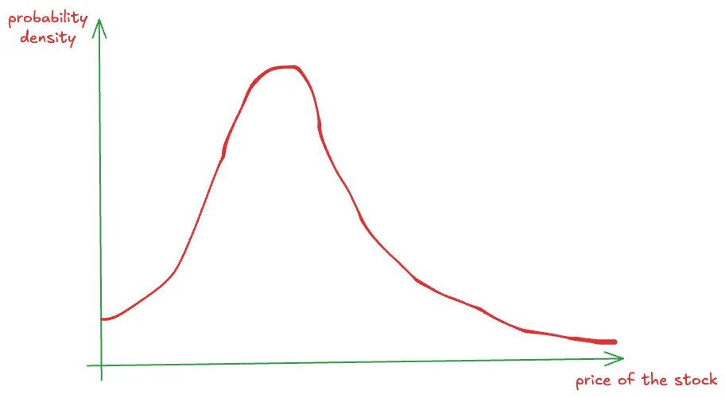

The world has some inherent uncertainty / randomness / luck factor, whatever you want to call it.

And we often abuse this fact:

1. Whenever something bad happens to us, it’s because of bad luck. Whenever something bad happens to others, it’s because they screwed up and made bad decisions.
2. Whenever something good happens to us, it’s because we worked hard for it. Whenever something good happens to others, it’s because of good luck and not skill.

You see the double standards, right?

This is because we’re not accepting the role of uncertainty and randomness in the world fully yet. And because of this, **the way we evaluate decisions is wrong.**

We’ve been evaluating decisions as if we were playing a game of chess — where there is no uncertainty, and the decision and outcome are perfectly related. A good move (decision) is by definition one that leads to a better position (outcome). Unambiguously.

But that’s simply not true in the real world. The correlation between decisions and their outcomes is not perfect — there is some randomness in between. You can make a good decision and still have a bad outcome. And you can make a bad decision and still have a good outcome.

An extreme example: Imagine it’s 2019. You have a wheel with the top 1000 US companies’ names on it. You’re going to spin it and then invest all your savings into that one company. It happens to land on Nvidia, and yayyy you become a zillionaire by 2025. Does this mean your decision (to spin the wheel and invest all your money into a single randomly chosen company) was good?? … No?

**A decision is not good or bad based on the outcome it produces.**

More generally, any information that comes to light after the decision was made cannot be used to justify the decision. You did not know that when you made the decision so how it can be a valid reason for making the decision!

In that sense, life is more like poker than chess. You have incomplete, and often even imperfect, information while making decisions. You don’t know the cards your opponents are holding, you don’t know what the cards on the table are going to be.

In fact, life has more dimensions of uncertainty than poker — in poker, you can calculate the exact odds your cards have of winning[^1] but in life, it’s hard to even estimate the probabilities of outcomes. “What’s the probability of X happening” is a very very tough question where X is some event in the real world — and there are many prediction markets (e.g. [Polymarket](https://polymarket.com/), [Kalshi](https://kalshi.com/), etc.) for you to test your skills if you feel confident in making accurate forecasts.

(That’s why there’s no GTO (Game Theory Optimal) calculator for life[^2] like there is for poker.)

But this does not mean all decisions are equally good or bad. Even though we cannot judge the quality of a decision solely based on its outcome, we can judge them by the process of arriving at the decision itself.

High-quality decisions are the ones which carefully **consider the possible choices** and the **outcomes they might cause**, and then **pick the best-suited one**.

Abstractly, this means:

1. You have some **utility function** that you’re trying to maximize. e.g. pleasure, success, meaning, work-life balance, productivity, whatever, some combination of everything you desire. You can choose this for yourself[^3]. Importantly, each person can have a different utility function. Someone might be more risk-averse and care about minimising the damage / losses in the worst-case scenario. Someone else might be risk-seeking, and want to maximize their best-case scenario only. Another might only care about the average result (aka expected value). It’s really up to you. You don’t need a mathematical formula for this. You just have to know what’s important to you and your priorities and preferences.
2. You have a bunch of actions / choices in front of you and you need to pick from that. It’s always helpful to take some time to enumerate all the possible things you can do because many times, you might miss out on some non-obvious ones. For example, if you’re given a job offer, at first glance, you might think that your only options are to either accept or reject. But in reality, you can also 1) negotiate the terms, 2) ask for more time so you can get another offer to negotiate from a better position, 3) … By not even considering these possible actions, you might be making suboptimal decisions.
3. For each action, there is an outcome. Well, there is actually an “outcome distribution” — this is where the uncertainty of the world kicks in. You can make a decision but that doesn’t mean the outcome is going to be exactly what you thought it would be. There is some distribution of possible outcomes with attached probabilities. For example, if you decide to start reading a book — maybe with 50% probability you will like it, with 30% you will find it “meh" but still finish it, and with 20% you will find it so dull and boring that you give it up halfway. Just because you decide to read the book doesn’t mean you’re going to like it. It sounds super common-sensical when I say it like this but I’ve seen this kind of thinking patterns many times in all sorts of contexts.
4. Estimating the outcome distribution is probably the hardest part of this process. And it only comes from having an objective and accurate understanding of reality. By detaching yourself from what you want to be true, to look at what is true. By trying to remove any biases in your thinking as a result of wishful thinking (to prevent “copium”). By seeing reality as is, without distorting it to fit your narrative. By _really_ being open-minded about the world. In fact, by seeking opposing views to balance your own so you gain a holistic understanding of the situation.

   The dangers of not being objective here are enormous. If you continue to live in your own bubble of beliefs and stories, you’re going to come up with a terribly skewed outcome distribution — which means your view of the future is going to be wrong, and you’re going to make bad decisions.

    It’s really important to try to be as objective as possible here. And I think the antidote to wishful thinking is a combination of self-awareness + humility + curiosity. Just the willingness to take the effort to know what’s real (while differentiating this from your own opinions).

    In this step, it’s also extremely useful to assign confidence levels to each of the decisions and outcomes. How confident are you of your own construction of the outcome distribution? This will dictate how strongly you feel about your decision, and when new information comes to light, you can update this confidence and adapt your views and maybe even change your decision if needed.It’s perfectly okay to be less confident in some decisions than others. What’s more important is avoiding overconfidence — being wrong and confident is worse than just being wrong.

5. Finally, every action you take, **every decision you make is a bet** that you think taking that action / decision will increase the value of this utility function the most among all possible actions that were available to you. So, based on the above analysis, pick the one you think is best suited based on your utility function.

Importantly, you acknowledge that there is some uncertainty in every decision you make. When you decide to do something, knowing full-well the possible outcomes it’s going to have.

One amazing benefit of this kind of thinking is that it’s **regret-free**. What’s there to regret if you know you made the best possible decision given the information you had?

Let’s look at some examples to explain concretely what this means:

**Example: Coin Flip**

I’m feeling generous so I invite you to play a game. I offer you 2 choices:

1. You flip a coin — if it lands heads, I give you \$1M and if it lands tails, you get nothing.
2. You get \$475k guaranteed without doing anything.

Which one would you pick? (Note that the “expected value”[^4] of option 1 is \$500k while that of option 2 is \$475k)

First of all, there’s no “correct” answer. Why? Because it depends on your situation and your utility function! For example:

1. You might pick option 1 if you are already very rich and this amount isn’t going to affect your life much. In that case, your marginal utility for the first \$475k is going to be about the same as that of the next \$525 (and both are going to be small amounts to you). In that case, it might make sense to try to maximize your expected value (i.e., average value) through this game and flip the coin.

   Why? Why should it be rational to maximise your EV in any single game? Why not take the second option and move on?

   Because in a single game, in a single decision, you are worried out the uncertainty and variance. But **life can be viewed as a series of such decisions**. If you always pick the choice with higher EV, you’re going to come up ahead in the long-run (on average) when the variance is dominated in comparison to the total utility.

   An easy way to understand this: If I offered you these 2 choices and said we’d do the one you pick 1000 times, then you would definitely pick option (1) right? Because in the long-run, variance isn’t going to matter much — sometimes in your favor, sometimes against — but your total utility is going to be dictated mostly by the average utility. So, picking option (1) makes sense — why would you throw away \$25k worth of utility?

   Now, even though you won’t be given this exact same bet 1000 times (sorry I’m not that generous), you will definitely be making many such decisions over the course of your lifetime. You can view them all together as a series of decisions.

   So, for _small_ decisions, ones that don’t impact or you ones that you know you will get to do many times in the future, maximising EV (and ignoring variance) is a reasonable strategy. (Remember it only works for small decisions, once where you don’t go broke because of any of them, and you can afford to keep playing!)

   Another reason why you might pick (1) is because you’re in some special situation where you need \$1M only and not a cent less. Say you owe \$1M to some mafia boss who will shoot you if you give him anything less than \$1M. And the money is due tomorrow and you have no other way to source this money. Then, yeah you pick option (1) because it gives you a 50% chance of living (while option (2) is pointless).

   Lastly, you might also pick (1) if you’re risk-neutral (or risk-seeking). You don’t mind the extra bit of uncertainty because you find much more joy in winning \$1M (more specifically, more than 2x) than in winning \$475k. I’ve seen this to be true in some people — they’re more willing to take on bigger risks because the rewards are also much higher (or more precisely, to such people, the rewards seem to compensate enough for the bigger risks). Naturally, such people also tend to be quite ambitious and entrepreneurial.

2. But most people under normal circumstances would probably opt for the guaranteed \$475k. Because 1) you know you’re not going to be offered a choice of this magnitude in the future again, and 2) this kind of money means a lot and would change your life.

   Some things to note here: “But Devansh, isn’t the expected value (EV) of the first option better??” Yes, but your utility function for money probably isn’t linear! The potential loss of not getting anything would be a bigger loss than the marginal gain of an extra $525k. And this is not true because of some complex math or anything — it’s true in life!

   The improvement (with respect to your quality of life and standard of living) is going to materially bigger when you get the first \$475k than the next \$475k (approximately ~\$525k). Law of diminishing marginal utility and whatnot

   I’ve also found this to be true for much simpler things in life — eating half a cookie gives me about the same joy as eating a full cookie (with half the calories and sugar intake and half the cost!). Of course, then it makes rational sense to always only eat half-cookies rather than full cookies[^5].

This simple example teaches useful things:

1. Maximising EV isn’t the main goal of making decisions! (I’ll admit, this took me a while to figure out[^6].) It’s to maximize _your_ utility function. And very very often, it makes sense to pay EV in order to reduce variance. That is, you might be better off getting less total utility (even on average) while also reducing your risk / uncertainty.
2. Rational people can see the same situation and act differently. Don’t assume that anyone who doesn’t pick the same option as you is immediately irrational and stupid. People need not have the same preferences as you do and can be in very different situations.

And this example seems contrived but it’s still applicable to many real-world decisions. e.g. Should you accept a job offer at a slightly risky startup that gives you a lower base salary but more equity as compared to a bigger company with a higher base salary?[^7] It’s the same principle — think about the odds of success of the startup (maybe even break it down into many different level of success), see the difference in EV, and finally pick the one that fits your “risk profile” (utility function) the best.

**Example: Going to a Party**

Caution: If you do this kind of thinking every time you’re invited to a party, you might see the number of invitations you get dwindling over time. Use at your own risk!

Suppose you’re invited to an impromptu party. You were planning to have a quiet evening and just read by yourself. Should you go or not?

In this case, the possible decisions are easy — either go to the party, or stay at home and read a book.

If you stay at home and read a book, you have no uncertainty — you know exactly how the night is going to turn out to be. You will have a good time and you’ll learn something new — and as knowledge compounds, you’ll be getting smarter in the long run if you consistently make this choice.

But there’s the the feeling of FOMO you might get depending on how amazing the party turns out to be, which you will definitely see on Instagram stories. What if turns out to be the best night ever and all your friends talk about this night for decades to come? Can you afford to miss it? (This is what I call FOMO-driven thinking, something I admit I do occasionally.)

If you go for the party, think of the possible outcome distributions. Maybe it’s not accurate to say “worst case scenario” here but the 5th percentile scenario (only 5% of scenarios are worse than this) would be that the party was absolutely boring. And in most of the average cases, the party would be fun and you’ll have a great time. Finally, in the 95th and above percentile scenario lies our FOMO — when the party turns out to be so spectacular that it you feel stupid for not going to it.

(All these numbers are very pretty much arbitrary — _just assigning a number to something out of thin air doesn’t mean you suddenly know it better or have more information_. Don’t get bogged down by them. It’s just useful as an exercise to quantify things approximately so you can think about them concretely.)

Now, if your utility function is purely driven by the desire to chase the best-case scenario, then you’ll end up always going to the party. And if you are too risk-averse and you think there’s always a chance that it might end up very boring (or into something that you don’t enjoy), then you would never go.

Maybe it’s also useful to consider how often you’ll get to make this decision? Is this a once-in-a-lifetime kind of thing (e.g. your friends are planning to backpack across Europe after graduating from university) or a normal routine party that happens every month or so?

In any case, a utility function that minimises regret is, to me, perfectly reasonable. (In fact, if you can say “I’m going to make this decision and I’m not going to regret it no matter what happens in the future” that already means you know a lot more about your own priorities and goals than most people.). **Follow the path of least regret.**

Suppose you know you have to work hard and study on the same night your friends are going out for a party (because you have an exam the next day), ask yourself: which one would you regret more — going to the party and doing poorly in the exam, or doing well in the exam and missing the party.

This comes back to your utility function too, in particular the temporal discounting you choose to apply: **how much do you discount the future relative to the present**? How much does 1 unit of happiness in the future mean to you today? Would you be willing to sacrifice 1 unit of happiness for 2 units of happiness tomorrow?

Since it’s hard to talk in terms of units of happiness, I’m going to use money as an example:

- If you had to work very hard (12 hours a day, every day) for the next 1 year and then you would be given as much as money as you need in your lifetime to live a comfortable life, wouldn’t you do it?

- But if I change it to, you had to work for 20 years in order to get that money, then you wouldn’t be as sure, right? Because although the remainder of your life is a long time, that is in the distant future.

Many people do things they don’t like because they know it’s “worth it in the long-run”. E.g. If exercising for 30 mins only gave you 30 mins of “extra life” at the end, no one would be exercising. Those 30 mins are worth more to you today than at the end of your life. So, what’s the point? It’s like moving your healthy years to the back of your life. But if exercising for 30 mins increases your lifespan by a day, then it seems like a good deal, right?

Generally speaking, those who set a lower discount factor, i.e., those who care about their future self almost as much as their present self, end up taking a longer-term view and naturally end up ahead in the long-run. **Delaying gratification is often a requirement for achieving longer-term goals.**

Linking this back to our original example: If you’re someone who is ambitious or disciplined (basically, willing to sacrifice some amount of pleasure in the present to eventually end up better off), then staying at home and studying or reading a book (or whatever other productive activity you're doing) can feel more useful to you, since your utility function does value the future-you’s happiness and betterment too quite a lot too. So, this does affect how you make decisions in your day-to-day too.

It’s a cliche, but still true: “discipline weighs ounces, regret weighs tons”. But this can be interpreted in one of two ways — is it the future regret of being worse off by choosing to enjoy the present at the cost of your future? Or... is it the regret of not enjoying your present enough (i.e., not going to the party)?

Of course, the intended interpretation is the former, since most people would feel more regret (albeit in the future) over a worse off future than over missing a single party. But my point is that it need not be true for every person. Depends on how amazing the party was, I guess.

In any case, the more general concept of **picking the decision which minimises total regret** holds true (though what actual decision that might be varies from person to person). I specify “total” regret because you can’t just look at the immediate regret you feel (because then you would always just pick the easy, more fun option), but the future regret that this decision’s consequences might cause too (which is often the dominant factor).

**Example: Betting on a Stock**

(Not financial advice!) If you were an undergraduate studying computer science with a specialisation in AI, and you knew a lot about AI, one of the best ways to make money might be to find up-and-coming AI companies and bet on them by buying their stocks.

Suppose you find company M.AI[^8] has just gone public. There might be a lot of analysts looking at their financials and stuff, but you think you know more because you understand their technology better than those “finance guys”. What should you do?

Assuming you’ve done your due diligence and are confident that their stock will be worth more in the future, what’s now important is to make this more concrete.

1. How much do you think their stock should be worth (aka fair value)? What’s your confidence on this?

2. How long do you think the market is going to take to get there? What’s your estimate of the trajectory of the stock in a month? 3 months? A year?

Say it’s at \$1.5 right now. Come up with a distribution of where you think the stock is going to be 3 months from now. e.g. 10% chance that the stock falls to \$0.0, 20% chance that it is \$1-2, 30% for \$2-5, 10% that it goes up to \$5-6, 30% that it goes to \$6+.

<figure>

<figcaption>Note: This is just an example of what you might come up with as your predicted distribution of the stock price in 3 months. It helps you quantify your qualitative prediction of “oh this stock will go up” and analyze it more rigorously + accurately.</figcaption>

</figure>

Then, think about your confidence level on this distribution itself. Like, how close to accurate this distribution do you think this is?

With all this in mind, size your bet accordingly. The higher your confidence and the more the expected return (based on the distribution), the more you should be willing to bet.

Say you end up buying \$5000 worth of this stock.

Now imagine it’s 1 year later. Because of some unexpected geopolitical crisis , the entire AI market crashed and your stock went to \$0.00 with it. You couldn’t have seen this coming (or even if you did, you probably thought the chances of this crisis were like 1%).

Was buying this stock still a good decision? Yes! It just didn’t turn out in your favour.

**Evaluating your own decisions**

Having learnt this, one common trap people fall back on is continuing to blame their bad decisions on bad luck — “oh I thought about it very carefully and I was 75% sure it was going to work out, but because of bad luck, it didn’t”. And now you can even justify it better by showing some random numbers you used while deciding which action to take. So, there’s a higher risk of being out of touch with reality and deluding yourself — a risk that you have to be constantly paranoid about, if you’re at all interested in understanding the world and making better decisions.

Remember, **this process doesn’t eliminate any uncertainty in the world**. It just gives you a better way to deal with it.

So, yes, there are still a lot of ways you can make bad decisions even while following this framework:

1. Having bad estimates of the future outcome distributions of actions.
2. Having bad estimates for your confidence in decisions.

The way to fix both is to close the feedback loop after you make the decision. Use the consequences to update your mental models of reality and your own confidence in them. Like, it’s all just bayesian thinking. Look at each piece of new evidence, your current level of confidence, and keep updating it based on how much weight you want to give to this piece of evidence. Again, you don’t have to actually do the math — rough approximations are good enough in most cases.

Let me give you some objective ways to evaluate your own decisions and estimates using basic statistics:

1. If you make 20 decisions in which you were 75% confident, you should expect ~15 of them to work out. If only 5 of them work out, chances are it’s not bad luck, it’s overconfidence.
2. If you are swinging your confidence levels in outcomes back and forth too much, chances are that you’re being overconfident again and giving too much weight to the new pieces of evidence. If you say you are 90% confident about X, and then you suddenly shift to 20% confidence when something happens, you must ask yourself: Was this new information in my original 10%? Or was I overly confident about my 90% and it should actually have been more like 50%? (Because if this happens too much, clearly your initial estimate of 90% can’t have been right — by definition, if you’re 90% confident about 10 things, you must be end up being right about ~9 times. So, if you change from 90% to 10% about half the times, then you weren’t ever at 90% to begin with.)

My recommendation? Write down each decision and the corresponding confidence level you have (remember: each decision is a bet, so how confident are you in the bet?). And then once the outcome materialises, you know whether your bet paid off or not. Use this information to figure out how well you’re doing. Again: it’s much better to be wrong for a decision in which you were 60% confident as compared to one where you were 95% confident[^9].

---

Footnotes:

[^1]: against an opponent’s range

[^2]: inb4 AGI comes up with a GTO calculator for life and says “sorry what were you saying?”

[^3]: to the extent you an control what you want out of life

[^4]: how much you can expect to gain in the long-run if you repeat this game many many times

[^5]: pro tip: just invite a friend every time you go eat a cookie or a waffle or a cake and split it

[^6]: especially because in most math games and puzzles I would solve, the objective was to always maximise EV

[^7]: im NOT saying that this is the only thing you should focus on while deciding which job to pick — of course, the mission of the company, the work culture, the work-life balance, blah blah, also matter (and probably more so than purely the monetary compensation).

[^8]: i normally use X for my variable names, but here unfortunately, using X.AI might give the wrong idea that i’m referring to a certain real company

[^9]: This kind of loss / penalty function — that penalises bering wrong with higher confidence more — is precisely what is used while training regression ML models (and is called log-loss). On the flip side, don’t use this as an excuse to never be confident in your decisions! You can’t put everything as 50% to avoid big penalties! Being confident and right is good is better than being unsure and right too. If you put 50% for 10 decisions, and you turn out to be right about 8 of them, then your actual confidence should have been closer to 80% (more precisely, the average confidence level across the 10 decisions should’ve been ~80%).
