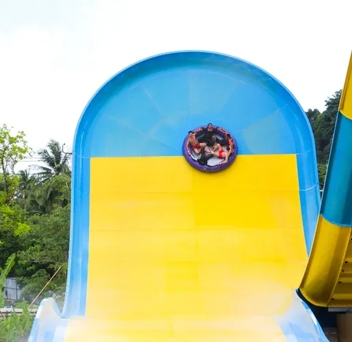
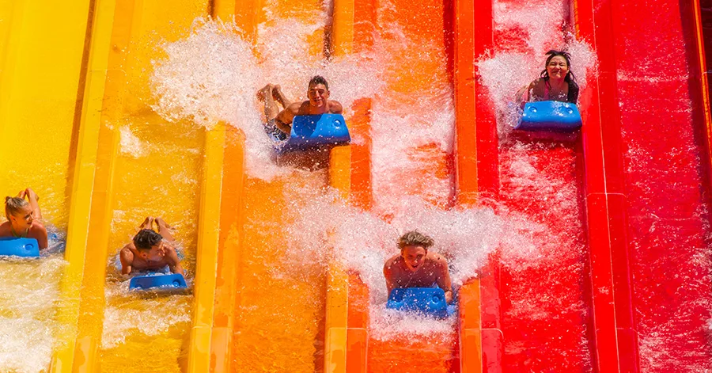
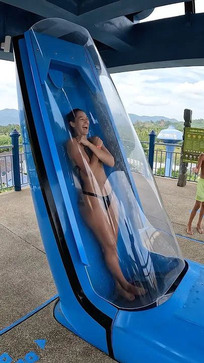
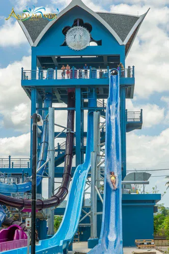

This is the story of how a waterslide changed my life.

Disclaimer: this is NOT a post about how to change _your_ life. It’s about me! Any takeaways you draw from this to try to use in your life are purely a result of your own imagination, don’t blame me.[^1]

I recently went to Phuket for a week with 2 of my high-school friends. We’d been talking about going on a trip for ~3 years and we finally did it - turned out to be one of the most fun trips ever!

On one of those days, we decided to go to Andamanda waterpark, one of Thailand’s largest waterparks.[^2]

We got there, and started off by doing some not-so-crazy rides - the ones where you all sit in a tube together and ride down a slide. Sometimes the tube very slightly lifts up due to the momentum, right at the peak (see image below) and you can almost feel your impending doom as you stare vertically down .

As you can probably already guess, I’m a wee bit afraid of waterslides. And even rollercoasters.

Actually, that’s not true at all. I love waterslides _and_ rollercoasters, just as long as they’re not too fast or have any upside-down loops. In other words, I love “medium-scary” waterslides and rollercoasters because they give me a great adrenaline rush, but I’m genuinely terrified of really-fast or “high-scary” waterslides and rollercoasters, somewhat by definition.

I can explain better: I enjoy having fun, with all the thrill and adrenaline that comes with it, BUT in a responsible, reasonable amount. Beyond a certain threshold, I just don’t find it fun - I find it scary and I don’t think I need that.

As a concrete example, 3 weeks before this Phuket trip, I was in Koh Samui on a company retreat, and there, while everyone else was jet skiing at 70-80 km/h, I was doing 30-40 km/h. Even if I tried really hard to not be scared, I couldn’t bring myself to go faster than that. My hands would just tilt the steering wheel, I would panic thinking that I was going to fall off and die, and immediately slow down. But, even at 30-40 km/h, I was having the time of my life, zipping through the waves, bobbing up and down, feeling the adrenaline rush through me.

“So what if I’m not going faster, who cares? I’m having so much fun, and why should anything else even matter!”, I thought.

Coming back to Andamanda waterpark.

The first scary waterslide that I was reluctantly going to do, semi-forced by my friends, was called the Racing Nagas:

We climbed up the stairs with the yoga-mat-thingy in our hands and once we reached the top, the waterslide-manager said “you have to jump on the count of 1. okay?” and without waiting for us to answer, he said “okay, 3…. 2…. 1… jump!!”

And I just froze.

I couldn’t bring myself to jump head-first into the slide. So… I just didn’t jump. RIP.

My friends, on the other hand, had already jumped and reached the end of the waterslide a few seconds later. They looked around and couldn’t find me. And then they realised what had happened. (I imagine them having a good laugh about this at this moment.)

I start to walk back down the stairs, thinking “nahhh i’ll do the other slides but this one’s a bit much for me”. While walking down I see both of them coming back up. Huh, I guess they loved it so much they wanted to do it again. I meet them halfway on the stairs, and they say “bro you have to do it, it’s not even that scary, trust me.”

And of course, I don’t believe them one bit. But after 30 seconds of them emphatically promising I would love it afterwards and that it’s genuinely not even thaaat fast, I decided to give it a shot. Argh peer-pressure.

And so we go back up: 3…. 2… 1…. JUMP! And I look at both of them, one on either side of me, not jumping until they see me jump. Argh, I guess I’ve no choice. “See you on the other side”, I say, and I jump.

I remember ~~singing~~ yelling a song during the 10-15s of the slide, and honestly, I loved it. They were right. I was wrong. I had nothing to be afraid of. We went back and did this a couple more times, until I’d gotten enough of it.

After doing this, I already considered my day at the waterslide a “success” - I had done something I was afraid of. Even though I was afraid _while_ doing it too.

All you need is friends who peer-pressure you into doing things that are good for you.

After that, we did some much-easier slides for about an hour or so, all of which we really enjoyed.

And then came the Final Boss of Waterslides. They had kept this set of waterslides for the end because even they were somewhat scared of it and wanted to build enough confidence by then to do it. Here’s how it looked:

So you get in an enclosed container, cross your arms and legs, and they count down 3-2-1, and then the floor is literally pulled from underneath your legs and you free-fall down for a bit.

the right-most one didn’t have the free-fall drop, but was also really really fast!

They knew I wasn’t going to do it, so they weren’t really trying to push me as much as they did for the Racing Nagas. So they went for it, while I stood their waiting and watching other people do the slides.

And for about 30 mins - while they went and did these slides - the thoughts flowing through my head were like (condensed for obvious reasons):

- “Why do people even do these slides? Are they all psycho adrenaline junkies?”
- “The thought of free-falling down through a tube is so crazy”
- “Actually, why is it crazy? Is this fear well-founded?”
- “Does it even matter why it’s well-founded? I don’t want to do it, I don’t need to do it, and that’s the end of it.”
- “Oh hey, there is A and there is S - my friends - they’re doing the slide right now”
- OMG how was it??? and they tell me it was really fun and I should do it too, but they say it with a lot less conviction than they did earlier for the Racing Nagas. They admit the free-fall is slightly scary. Then they go do other variants (the purple one, see image above).
- I see this young girl do the ride and she looks so thrilled coming out of the slide. I see a few adults - mid-30s - do the ride and they look so satisfied with themselves. I see an older woman - mid 50s - do the ride and she looks scared but also really satisfied. I don’t see anyone who does the ride and comes out crying or saying they hated it or never want to do it again.
- “Okay I’ve seen ~50-100 people do these rides and not one of them was sad afterwards, or regretted doing it. So what’s the worst that can happen? How many [micromorts](https://en.wikipedia.org/wiki/Micromort) can this slide possibly be? I know sky-diving is roughly 10 so surely this has got to be like less than 1?”[^3]
- “And hence, clearly this “fear” is irrational.” ← I think this was the turning point - the point of no-return. Because it contradicted another belief that I think I’m a “practical” person and once I realised that this fear was completely irrational and I didn’t have even ONE good reason to not do the waterslide, I knew I was going to do it. The probabilities had shifted from 1 : 99 to 51 : 49, and the “do it” side was now winning.[^4]
- My friends come back after doing the other variant too, and now start to convince me again - “the entire ride lasts only 5 seconds and it’ll be over even before you know it”.
- “Actually, ~10 years ago, I was extremely scared of doing this one super-fast rollercoaster in universal studios, and 3 of my friends forced me - literally by holding me so I couldn’t leave - to get on it and I ended up loving it and doing it 5 more times that same day. So, I’ve seen this pattern before: I think I don’t like X and I’m scared of X, people tell me to just do X, I do X, I end up loving X. Maybe this time is no different and I should give it a shot.”
- "If you don't experience real fear from time to time, your mind creates fears out of nothing." - Alex Honnold.
- “I’m probably never coming back to this waterpark - do I really want to leave this place knowing I left something incomplete, out of irrational fear?”
- “What is true is already so. Owning up to it doesn’t make it worse. Not being open about it doesn’t make it go away. And because it’s true, it is what is there to be interacted with. Anything untrue isn’t there to be lived. People can stand what is true, for they are already enduring it.” - Eugene Gendlin ← one of my favourite poems, which I sometimes say to myself to prime myself to be honest with myself. And in this case, the honest answer was that 1) I was scared, 2) I had no good reason to be scared, 3) I wanted to conquer this irrational fear.
- “Heck, I’m going to do it.”

At the end, I knew I would remember these 30 mins for a long time. Something in me had changed. And I can finally put it into words better than I could’ve on that day: I had never seen myself _as someone who could_ do these kinds of waterslides. I’d gone to tons of theme parks as a kid - think: 7 - 14 years old - and in all of them, I would always do all the rides except the biggest, most badass scary ones. This kept reinforcing the self-image of myself as someone who could not do those kinds of slides. And then I’d started to rationalize that as being the case because I did not _want_ to do it. All the talk of “I don’t need that much adrenaline in my life” was simply a self-deceptive lie created so I didn’t have to come to terms with the truth of “I see myself as someone who can’t do it.”

Also, I observed that I had to really _really_ wrestle with a part of my mind which kept saying I couldn’t do it / I didn’t want to do / there’s no point in doing it or whatever, to even get to the bottom of this train of thought. It kept trying to shut down the conversation I was having in my mind without giving a real answer. It kept saying that this decision didn’t need any explanation. I had to keep asking “why” and keep pushing to get answers from myself. I had built walls around this belief, this self-image, protecting it from anything that seemed like an attack, and rational questions were most definitely attacks. I had to break down those walls, brick by brick, so I could assess from first principles whether this belief made sense or not.

Yes, it was a slow and arduous process. If you’ve ever genuinely changed your mind about something you believed deeply, you’ll know what I’m talking about.

I went with my other friend to the top of the waterslide. Even as I got inside the enclosed chamber, I was scared. 3…. 2… I took a deep breath and closed my eye. 1…. BANG. I feel myself falling down. I hold my nose and cover my mouth and don’t breathe at all so that water doesn’t enter and choke me. It only lasts about 5-7 seconds.

It’s over.

I did it. I DID IT!!!

And that, my dear readers, was the best feeling ever.

I know people will think I’m exaggerating when I say this, but I believe it to be 100% true: I’m prouder of doing this one waterslide than of graduating from university.[^5] Why? I never had any real doubt that I would graduate - I’ve seen myself as an intellectually-curious person since I was a kid and have enough evidence to believe I would do okay in university. On the other hand, I had no doubt that I would never have done this waterslide in my wildest dreams and I also had a lot of evidence supporting this (e.g. NOT doing scary slides in other theme parks). So, the satisfaction and pride in doing something I never thought I could is definitely a lot more in this case.

Afterwards, I tried to generalise this experience and the lessons _for myself_ because why keep this restricted to just doing waterslides? And I came up with:

1. Think about other areas of life in which I have a “self-image” that is preventing me from doing something. Break free from it. I know it sounds easy and it’s going to be really hard in practice, but the alternative is scarier: I don’t want to wait until I’m 40 years old and still have this constraining myself and wonder about all the things I’ve missed out on as a result of this.
2. Think about other things that people consider “normal” but I’ve a preconceived notion of why it’s not normal / why i wouldn’t do it. Question it and see if it holds up to critical cross-examination.

I then easily came up with ~5 more areas in which this applied too. That is, I just did this:

“I don’t see myself as someone who  _______” → why not?

and realised that for most things, I didn’t have good reasons beyond the fact that it was unfamiliar, uncharted territory for me. Fear of the unknown.

(The converse is also a good exercise: “I see myself as someone who  ____ “ → why?)

Don’t get me wrong - all this is NOT me trying to say “I’m not afraid of anything anymore!”. Far from it, lol. I’m pretty sure if I go back to Andamanda waterpark again, I’d still be scared of doing the same waterslides. The only difference is that now I _know_ that I’d do it anyway.

Once you see the light, there’s no turning back.

In general, I think any “life-changing” moment (the way most people use it) can be broken down into 2 phases: 1) when you change some core belief, 2) when you actually use this newly changed belief to do things you wouldn’t have otherwise have done.

Without (2), (1) is pretty much useless. What’s the point of changing how you think if it doesn’t change how you do anything else in life at all? But at the same time, beliefs and mindsets are leading indicators of decisions / actions, and there’s typically some time delay between (1) and (2).

Anyhoo, I’ve had more belief-changing moments in the past 2-3 years than I’ve had in the ~20 years before that.[^6] Is this what it feels like to be truly conscious, truly alive? Because I LOVE it!!

And I’m (slowly) making progress on converting all these new / changed beliefs into actionable decisions. Time will tell.

This is what I mean by life-changing.[^7]

[^1]: on the other hand, i’ve infinite patience if you want to thank me xD

[^2]: although they keep marketing it as THE largest waterpark, i found no solid evidence of this being true. seems like “Ramayana Water Park” is also cited to be the largest sometimes with no clear winner.

[^3]: this was actually pretty stupid of me in the moment because this isn’t new information / evidence - i KNOW that hundreds of thousands of people come to this waterpark and do these slides every year so surely people generally enjoy it. but i guess seeing things with your own eyes makes it more believable, which i continue to think is a bug, not a feature.

[^4]: once you assign a higher probability to something, you [change your mind less often than you think you do.](https://www.lesswrong.com/posts/buixYfcXBah9hbSNZ/we-change-our-minds-less-often-than-we-think)

[^5]: to be clear, this includes _just_ graduating normally from university - getting a degree - not any other achievements associated with graduating. i’m still quite happy about those.

[^6]: though there’s strong recency bias, i sat for 5 minutes with my eyes closed trying to remember experiences in school and i couldn’t think of more than 2.

[^7]: P.S. This time in Phuket, I jet skied much faster because the thought of “there’s no need to go faster” faded away. There was a need. I had to do it to prove to myself I could do it. I just went flat out. I decided the strategy was to look at the island in the distance, instead of the incoming waves, to not “feel the speed as much”. Quick physics lesson: your body “feels” acceleration, not velocity. If you close your eyes in a car moving 100km/h, you won’t be able to tell you’re moving. If you look outside at the trees or the road, you’ll know you’re moving. But if it slows down or goes faster, you’ll still feel it. For obvious reasons, I decided not to close my eyes while jet-skiing but look as far ahead as I could so I don’t feel the speed as much.
