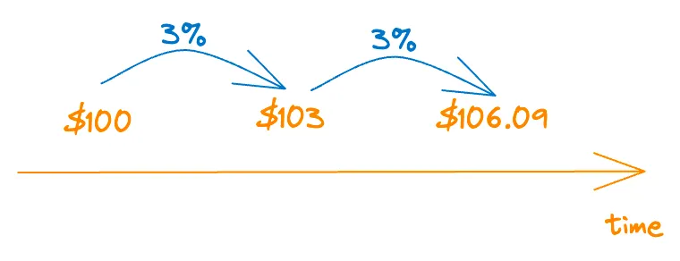
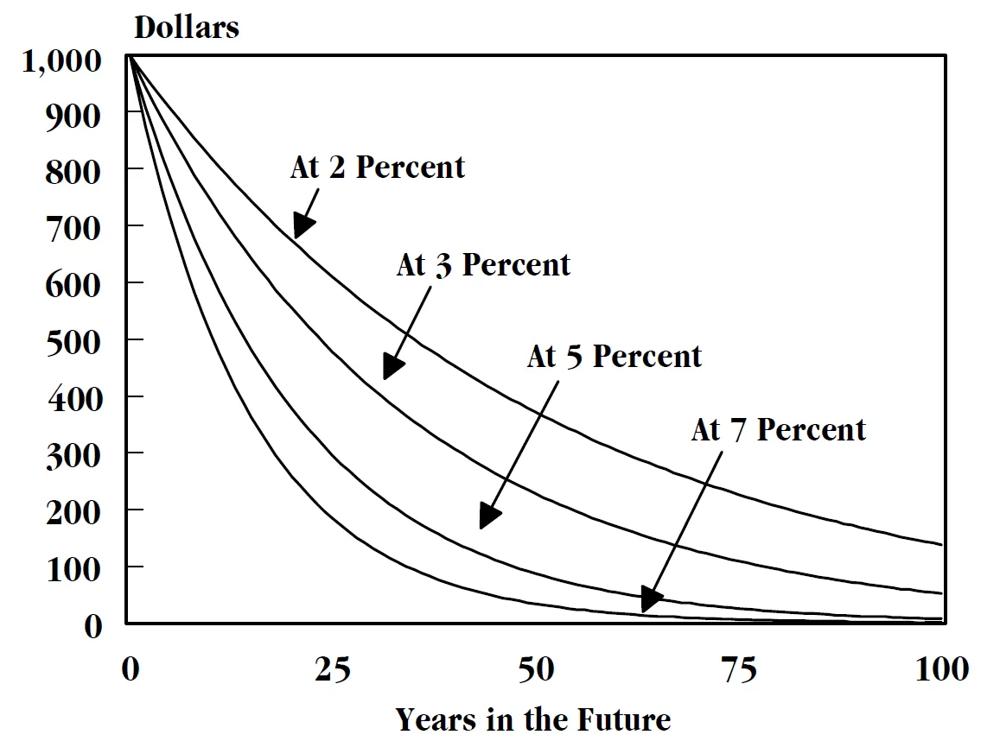

## Motivation

There's so much jargon and math involved in explaining basic financial concepts that people often don't understand the bigger picture - why money works the way it does and how time affects the value of money.

This article does NOT provide a rigorous mathematical analysis (no, we have enough textbooks for this) but aims to improve conceptual understanding using simple concrete examples. Once you know how the financial world works, the formulae become self-evident and intuitive. (it feels like a cardinal sin to teach people the formulae without telling them how the formulae came into being → a formula is not an arbitrary collection of symbols, it's common sense once you've understood the logic)

Throughout this article, for the sake of simplicity (and to show that inflation is an entirely different, though related concept), we assume there is no inflation (i.e., the cost of an item - say, a chocolate - is the same today as it will be anytime in the future).

Let's start with a behavioral experiment: If you had the choice, would you rather get \$100 today or \$100 a year from now? Assuming you're like most people (and rational), you would much rather get the money today. Why is that so? Because fundamentally, we prefer certainty over uncertainty, the present over the future. The future is more uncertain than the present - we don't know what can happen from today to next year. Notice that this is true even if there is no inflation (in terms of chocolates, if each chocolate costs \$2 today, you can buy 50 chocolates today. And since the cost of chocolate remains the same next year too, you can buy 50 chocolates using the $100 next year too).

But it's just not the case that we prefer money today over the same amount a year from now because of our tendency to avoid uncertainty - in fact, it's purely rational in the economic sense too.

You've probably heard that money today is “worth” more than money in the future. But what does that really mean?

If \$100 today can buy 50 chocolates today, and \$100 a year from now can buy 50 chocolates too, in what way is the money today worth more? This is actually a really insightful question.

The only difference between the 2 scenarios is that they're separated by time - one year to be precise. This means that if you get the money today, you can “do something with it” and possibly make a profit using this money.

I deliberately use the (admittedly vague) phrase “do something with it” because the truth is that you can do tons of things with it - put the money in a bank (and gain interest), invest in the stock market (and possibly make a fortune), start a business of your own (and make profits), etc. These are all the things you can do if you get the money today.

On the other hand, if you only get the money next year, you can't use that money to do anything between now and next year. So, this opportunity of “doing something” (which we will now call an “investment opportunity”) is delayed by a year.

Observe that none of the above investments are directly related to inflation.

And that is the true “time value” of money. The same amount of money today is worth more because you can invest it and earn profits through the investment. This is called the “earning potential” of money in the time period.

Okay, so now we know that \$x today is worth more than \$x a year from now. But what if we wanted to calculate exactly how much \$x today is worth a year from now?

Well, we can consider this scenario: if you receive \$100 and just put it in your savings account (with a 3% interest rate), you'll have \$103 at the end of the year. So, \$100 today is worth $103 a year from now.

But wait. What if you decided to use the \$100 to create your own cryptocurrency (or a dropshipping business) and that grew to a \$10,000 company in a year. Does this mean that \$100 today is worth $10,000 a year from now?

The answer is no. The reason is that anything physical you do in the real world has some inherent risk associated with it. It could very well be the case that your cryptocurrency (or business) fails and you're left with nothing. So, there might be a 0.01% chance that your business succeeds (and you end up with \$10,000) and a 99.99% chance that it fails (and you have $0).

But there are (literally) an infinite number of ways you could spend the \$100 - so how do we calculate the exact “worth” of it in the future?

We can consider the scenario where we invest the \$100 in a “riskless asset” - basically something with a zero (or near-zero) probability of not paying back the money it promised to. Depositing your money in the bank is essentially a “riskless” investment for all practical purposes (well, it might have some risk if the bank goes bankrupt and is unable to pay you back). Buying government bonds (of “stable” governments) is also practically riskless. This simple idea also implies that all riskless investments must have the same yield/returns.

In our example, if the annual interest rate is 3%, \$$x$ today is worth \$$1.03x$ a year from now.

This also means that if you have the choice to pick between receiving \$100 today and \$200 a year from now, you should pick the latter (unless you have some really clever plan to make money or desperately need it).

Now what if you want to calculate how much \$100 a year from now is worth today. In other words, how much money should you be given today that will be equivalent to giving you \$100 a year from now. Well, the answer is simple (because now you know how money works!): if you're given \$$\frac{100}{1.03}$ today, you can deposit it in the bank and at the end of the year, you'll have \$100 (since interest rate is 3%).

More generally, assuming an interest rate of $r$% compounded annually, \$$x$ today is worth \$$x(1+r/100)^t$, $t$ years from now.

Using the above formula, we can “move money through time” since we know exactly how much any amount of money is worth at any time in the future. Similarly. can bring “future money” into the present too.

## When Inflation Rates are Non-Zero

As a last example, let's consider the case where the inflation rate is not zero - suppose it is 5%. This means that the price of goods (chocolates, in our case) rises by 5% over the year. So, if chocolates cost \$2 today, they'll cost \$2.10 one year later. This means that even if we have the same “numerical amount” of money (i.e., $100) one year from now, we will be able to buy fewever chocolates. That is, inflation causes the “value” of money to erode over time.

Note: ”numerical amount” is correlated with “value” but does not include the aspect of time. If you shove \$100 in your pillow and take it out after 10 years, it'll still be \$100 numerically, though it's actual “value” would be much lower than the $100 you had put in → because of the inflation caused by time and the earning potential lost. In other words, if you want your value of money to remain constant over time, it's numerical amount must increase.

HIgher inflation rates mean that the value of money erodes faster, and so, money today is worth much more than the same “numerical amount” a fixed time period from now.

Another way of looking at it is that when inflation rates are high, you “discount” the future more, i.e., your “future money” is worth less than it would be without inflation (both of which would be less than your “present money” - assuming the same numerical amounts.)

## Time-Money Equivalence

Bonus: there's a much deeper connection between time and money, a connection that transcends finance and economics, or any discipline for that mater. Think about this: when you work, you're being paid for your time spent. That is, the money you make tells you how much your time is worth. On the other hand, if you don't want to do some work (e.g. drive somewhere), you can pay somebody else to do it for you, and suddenly you free up that time. So, you can create money by spending time, and you can create time by spending money! The adage “time is money” is literally true - time and money are equivalent in the real world, just as mass and energy are equivalent in physics.

## Conclusion

I hope you have a better understanding of how time can (literally) “create money” and why time plays such an important factor in understanding how money works.
