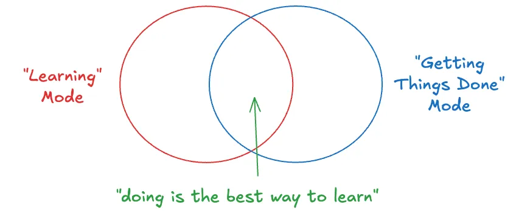
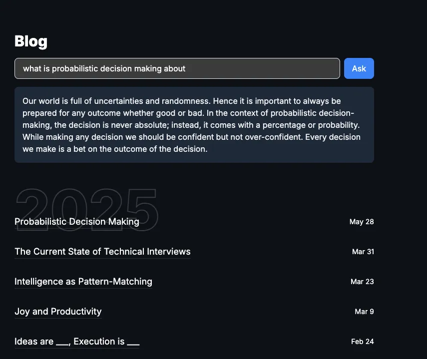
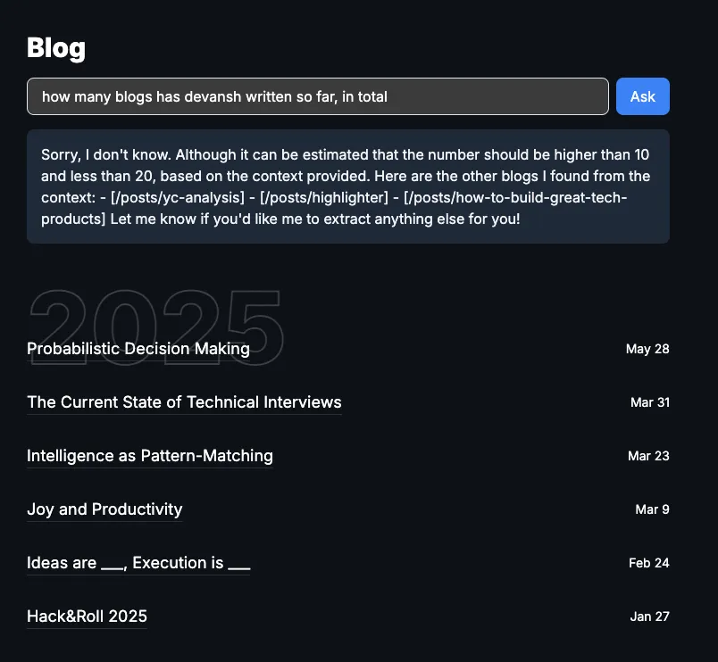

7 months ago, I [wrote](https://www.devanshshah.dev/posts/learning-vs-getting-things-done):

> Broadly speaking, there are two kinds of modes you're operating under: "learning" mode, and "getting things done" mode. And these modes are not mutually exclusive. In fact, one of the best ways to learn something is to just get your hands dirty and do it. The best way to learn how to code is to code. The best way to learn how to write is to write.

> …
> It's much more tempting to just get help to solve your problem, rather than get help to learn the concepts better.
>
> But if you choose to, you can use AI to accelerate your learning at a faster pace than was ever possible before. You have a personalised tutor available 24/7 to help you understand better. All you have to do is ask. Instead of asking it to solve your problems, ask it to explain the concepts involved. And then have the self-discipline to actually try to achieve mastery of those concepts.
>
> If you were in primary school learning basic arithmetic, and you had a calculator, you could do two things: 1) cheat using the calculator in the exam (assume it's invisible so you won't get caught), or 2) use the calculator as a personal grader and practise questions without relying on someone else.
>
> Right now, each of us has this calculator. And if we use it right, we can develop our skills, deepen our understanding, and develop true knowledge, without depending on anyone else. If not, we'll wind up completely dependent on the calculators, praying that the battery doesn't run out, or that we don't ever have to solve anything involving geometry / integration / (something that can't be solved using a calculator).
>
> The choice is ours.

The tl;dr was that you can either use AI to just get your things done, or to help you get better, and it's important we're intentional about the choice we make.

I used this same advice myself while I was building a RAG chatbot for my blogs a few days ago.

### Context

I was building this purely for fun, out of curiosity to learn how to integrate LLMs via an API into a full-stack project. I had no deadline and no pressure to "achieve" anything through this project. And I also had a lot of time on my hands[^1].

I also knew nothing about any RAG-specific tools before I started — though I knew the "theory" of RAG, embeddings, LLMs, etc. That is, I had no clue how to get started _building_ a RAG chatbot.

### Process of Building and Learning

As much as I love vibe-coding, I didn't want to just vibe-code my way through this because I knew I wouldn't learn anything if I did that[^2].

But of course I still wanted to use AI to help me in my process.

So, first I used ChatGPT deep research to help me "generate the high-level plan on how to design and build a system to create a RAG chatbot for my blogs, on my personal website which is built in using astro, hosted on … and please find tools with a generous free tier".

And it came up with a fantastic 6-step plan on what I'd have to do!

Next, even though I used Cursor to code, I read through each line it wrote. It got some things wrong the first time (e.g. the chat interface did not have a light/dark theme) and I asked it to fix it. It's not vibe-coding if you're carefully reviewing the code, tweaking things before approving it and testing if things work as expected.

And most importantly, for each term, concept, or code that I did not understand, I would ask ChatGPT to explain it in detail. And I would keep asking clarifying questions till I understood it 100%. Sometimes, it wasn't giving me enough detail so I just went straight the official docs and read the relevant section myself.  Sometimes, I thought of a different way of doing things and asked it whether that made more sense to implement.

For example:

[AI]: Here is the SQL code for creating the table to insert the embeddings of your chunks and the IVF_FLAT to search for nearest neighbours efficiently

[Me]: I don't get why we need to store both "post_url" and "slug" since one can be derived from the other?

[AI]: Oh yes, you're right. Let me correct…

[Me]: Also, what does the lists parameter do in the index? What is a reasonable value to set it to?

[AI]: <Explains>

[Me]: Also how does exactly the index help improve the query for nearest neighbours? What's the algorithm?

Basically, you can afford to ask very basic questions, look foolish in front of AI and it's still not going to judge you for it![^3]

And I think that's the key: constantly asking questions if you're not sure about something. To get a very deep understanding of the topics you're interested in.

Why? **Because knowing the internals of a system also makes you a better user of it.**

Knowing the internals of how RAG works makes me a better user of similar RAG chatbots too.

I know the kinds of questions it's going to be able to answer and the kinds it's not. It's good for questions that will have a specific answer in some paragraphs of text. It's NOT good for generic questions that need a lot of information at once.

I know that I need to use the right keywords in my question to generate the "right" query embedding so that it can find the relevant passages / information from the text. If I know the title of the blog I want to query, including that in the question would definitely help too.

For example, asking a specific question about a recent blog I wrote gives a pretty decent answer:

But asking a question like this:

gives a pretty… stupid answer? From an average user's point of view, the chatbot clearly has access to the blogs (it even quoted some of them in the answer!), and it just needs to count how many blogs were written between 2 dates. It should be trivial to answer! right… ?

Unfortunately, "raw"[^4] RAG cannot answer this because it doesn't send all the blogs to the LLM that generates the response — that would be too huge of a context! It only sends the chunks of text (read: paragraphs) that it thinks are most relevant to the question. And mostly, the number of chunks added to the context of the LLM are limited to some fixed number (I used 10). So, even if I've written > 10 blogs, the LLM that generates the answer only gets chunks from at most 10 unique blogs and it knows nothing about the others.[^5]

(If you want to come up with more adversarial questions, feel free to play around with my chatbot [here](https://devanshshah.dev/blog)!)

Lastly, through building this simple chatbot, I found that **AI Engineering is 90% traditional software engineering** — APIs, databases, frontend, deployment — **and only 10% AI-specific stuff** — chunking, embeddings, tweaking model params, etc.

So I think unless you're working on the model directly, most of the work is probably going to be to write glue code (normal software engineering stuff) that connects AI to the different parts of the system. Because at the end of the day, an LLM will just be an API call.

**Final Remarks**

It's been a long time since I built something where I was a complete beginner[^6]. And honestly, this felt amazing. I had forgotten how refreshing it is to not know what you're doing and to figure things out along the way. How peaceful it feels to explore without expectations, and to learn just for the sake of learning.

It felt fun. Playful. Pure. It reminded me of why I got into tech in the first place.

So if you're learning something new right now, I genuinely hope you're _really_ enjoying it. There's real joy in being a beginner!

[^1]: I had just returned from a 5-day trip traveling Munich + Garmisch, I was tired and did not want to leave my house for a couple of days so this was the perfect mini project to take up.

[^2]: And that's why context is important! If my goal was to ship something by a deadline, learning would be a secondary goal and getting it done would be the primary goal.

[^3]: Use temporary chats if you're really worried that OpenAI will hold such conversations against you when applying for a job there xd

[^4]: My guess is that all SOTA models have much more complex interactions that decide what additional "tools" to call based on the query - and in this case, they would simply call the "query_database" tool and write a simple SQL query to obtain the necessary info and then answer the question based on that.

[^5]: I've no clue how it determined that the upper bound is 20 though — probably just made it up?

[^6]: I felt this way when I studied business law last semester too — though I don't think it's the same because I wasn't actively creating / building anything using that new knowledge. This is what makes tech special: you can actually build stuff using what you learn _immediately_!
