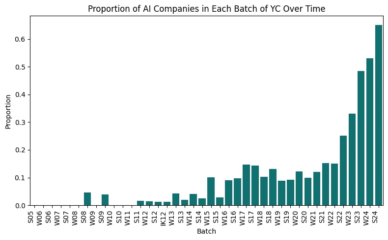
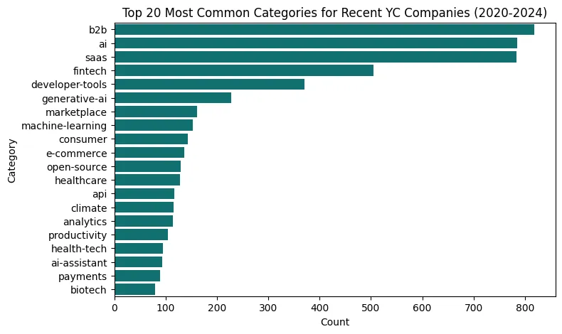
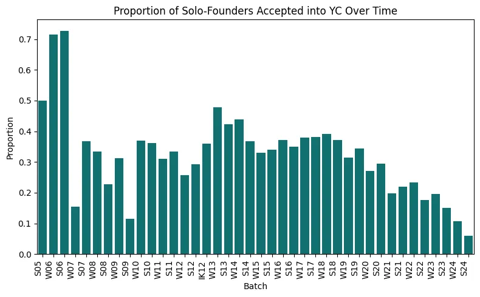
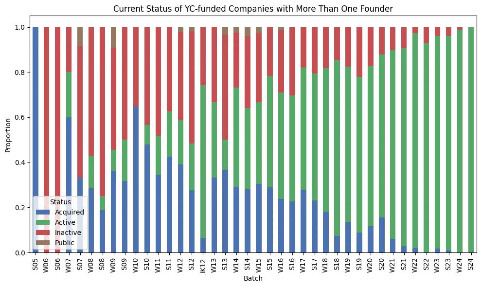
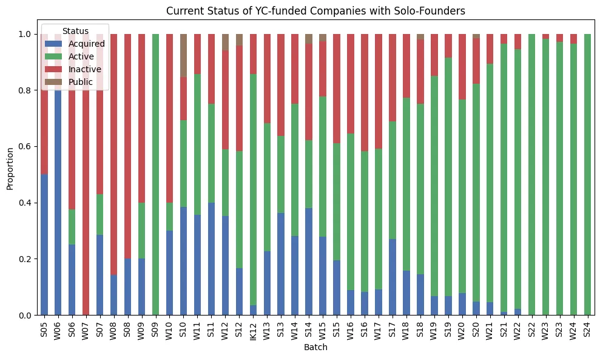
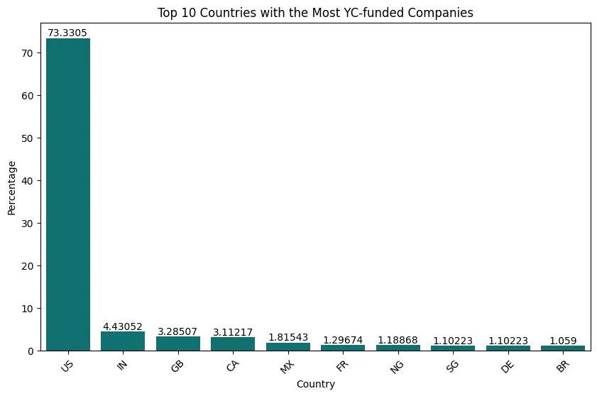
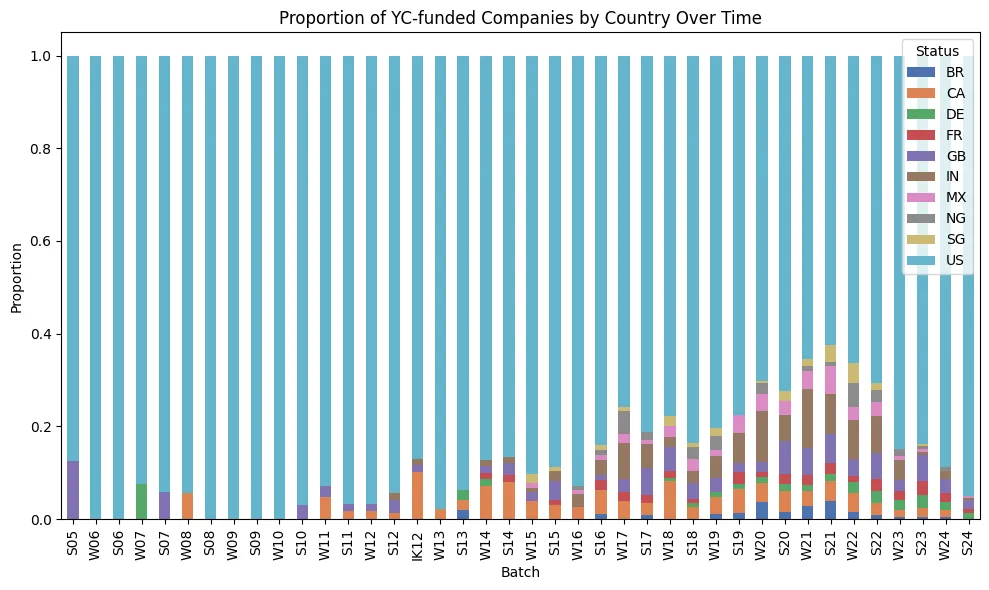

## Introduction

Every few months, I end up scrolling through the Y-Combinator (YC) [startup directory](https://www.ycombinator.com/companies) to see the cool new startups they funded. It gives a good flavour of the entrepreneurial and tech scene in Silicon-Valley and the kinds of projects that people are working on (that have the potential to change the world).

But this time, I ended up doing something different. Instead of focusing on the uniqueness of every startup, I looked at the bigger picture, and tried to find some trends, patterns, and interesting statistics from the data.

Here, I hope to present the data in an objective manner, suggest some possible conclusions, and then, you can decide what you believe for yourself.

## Data

I found a YC-directory [scraper](https://github.com/corralm/yc-scraper) on Github which works for the most part (massive thanks to the author!), but I think YC may have recently changed their page structure, which was causing some issues with scraping the tags from the latest batches.

I used the [csv](https://github.com/corralm/yc-scraper/tree/main/data) that the author had already created (available on Kaggle too), and then added the missing data using a slightly modified version of the scraper.

In the end, I had nearly 5000 companies that YC had funded to date, starting from 2005 all the way up to 2024.

Before getting into the trends, it’s important to highlight some of the key features (and limitations) of this dataset:

### Absence of Prior Distribution

This might be seem like a subtle technicality but it’s not. Because we don’t have information and statistics about all the startups that apply to YC in the first place (only the ones that get in), we can’t reliably draw conclusions about anything that involves the distribution of companies applying for YC.

It’s kind of like not knowing the “base rate” that we’re dealing with when we’re looking at the posterior probability of an event. So, we can’t use this data to see what kinds of companies are associated with higher chances of getting into YC. For example, even if 60% of the companies that YC accepted this batch are AI-related, it doesn’t mean your chances of getting in are better if you pitch an AI-related idea than a biotech-related idea (because a million people might be submitting AI idea, while only a thousand might be submitting a biotech idea — numbers here are for illustrative purposes only).

### Multi-label Classification

Essentially, each company can fall under multiple categories.

For example, Dropbox falls under “B2B” as well as “Productivity”, Reddit falls under “Consumer” as well as “Content”.

## The Rise of AI

Clearly, AI is all the hype right now. And here’s some pretty damning evidence to back this up:

The above graph shows that the proportion of YC-backed companies that use AI has seen a huge increase in the recent years. Over 60% of the companies that were accepted in the S24 batch used AI as part of their solution.

A reasonable inference is that YC is investing heavily in AI-focused companies. It’s making a bet that AI is going to be the “next big thing”. This speaks a lot about the current tech landscape and where it’s headed.

## Most Common Sectors that YC Supports

A pretty natural question to ask is: What kinds of companies has YC been funding in the past, say, 3–4 years?

This is useful information to know if you’re planning on applying to YC or even just interested in getting a feel for the latest trends in technology.

It might not have been obvious that B2B startups are the most common type of startup that gets funding by YC, even more than AI! And that developer-tools-related startups are so much more commonly accepted into YC than consumer-facing products or even healthcare / e-commerce… Yeah, I wouldn’t have been able to guess this beforehand.

## Solo-Founders at a Disadvantage?

There’s a [lot](https://www.reddit.com/r/ycombinator/comments/18i9dpe/why_it_is_so_difficult_for_solo_founders/) of [discussion](https://medium.com/the-launch-path/as-a-predictor-of-startup-success-whats-better-solo-founders-or-founding-teams-20f4518dbfc3) on whether being a solo-founder makes it (statistically) harder to succeed (or get into YC).

While Sam Altman was the President of YC, he [wrote](https://news.ycombinator.com/item?id=9239322):

> We really prefer at least two founders, but it’s not a deal-breaker.

And the data speaks quite clearly:

Over the past few batches, the proportion of solo founders in the batch has gotten smaller and smaller, to around 10% in the latest batches.

What’s also interesting is that in the period when Sam Altman was President, from 2014 to 2019, this proportion, um, barely changed? It only started declining from 2020 onwards, after Geoff Ralston became President, and even further after Garry Tan took over.

I guess one other theory is that the ratio of solo-founders to non-solo-founders in the “application pool” has also gone down (and YC still accepts the same proportion of solo-founders that it sees, but this number itself has been going down), though it doesn’t seem as likely.

Regarding the claim that it’s harder / easier to succeed as a solopreneur, here are two charts showing the current status (whether they’re active, or have been acquired or gone public or dead) of companies with >1 founder, and those with 1 founder.

And while there are some cases (e.g. W06, S06, W07 batch) of clear difference, there doesn’t seem to be a clear overall trend..? If anything, one can argue that there has been a higher proportion of solo-founders who end up taking the company public (a pretty clear sign of success?) of roughly 0.6% versus the 0.3% for teams with more than 1 founder. But this is based on a total of only 19 companies that went public — too small to make a strong claim.

Another theory might be: well, it is actually harder for a solo-founder to succeed compared to teams of more than 1 person, on average. But because YC already has a higher bar for solo-founders, you have a sample bias in which the solo-founders you’re looking at are probably the best out there (since they met a higher bar than the other teams).

## US and The World

It probably is no shock that the largest number of YC-backed companies are based in US.

But… it IS pretty shocking that this number is more than 70% !!

Out of all the companies YC has ever funded, 73% have been from US, and the next top 9 are India 🇮🇳, UK 🇬🇧, Canada 🇬🇧, Mexico 🇲🇽, France 🇫🇷, Nigeria 🇳🇬, Singapore 🇸🇬, Germany 🇩🇪, and Brazil 🇧🇷.

Again, probably not what I would’ve guessed?

And interestingly, this proportion seems to be relatively stable throughout the years (except during Covid), with a gradual increasing trend of non-US companies:

During Covid (2020–2022), the proportion of non-US companies reached its all-time high (of ~40% in 2021). Note that in this period, the YC program was held remotely, which is probably why more people around the world could apply and attend the program, without the “hassle” of having to move to another country (and things like a visa couldn’t get in the way). This is consistent with the sharp drop in the proportion of non-US companies after Covid, when YC moved back to its in-person (in San Francisco) program.

Even then, it seems quite surprising that such a high proportion of companies that join YC are based in US, when YC itself has achieved global fame. Here are some probable theories:

1. Maybe YC *does* take into account where you’re based and how likely you are to move to Silicon Valley for the 3 months, which is why it actively leans towards supporting US-based companies more than others.
2. This “country” field is the country where the *company was registered* — not where the founders came from. It’s possible that the founders are another country but haven’t incorporated the company before joining YC and so, when they join YC, they just decide to incorporate it in US (which causes the number of “US”-registered companies that are accepted into YC to increase).

## Future Work

While this dataset is pretty great, there’s a lot more that can be done! Here are some ideas for future improvements:

- **Including valuations and funding amounts in the analysis**: I don’t think the YC website itself has the current valuations for each of the startups. But I did find this website — <https://ycdb.co/> — which has more information about the valuations, and a ton of other metrics.
- **More Detailed Features**: It might be interesting to analyze which “features” are most correlated with success (in terms of valuations). I’m almost certain that YC does something like this internally too, and they probably have a list of the top predictors of a startup’s success (based on their portfolio), even including things like “founder’s past experience”, “founder’s attitude”, etc.
- **IK-12**: I wasn’t sure how to deal with the [Imagine K12](http://www.imaginek12.com/our-startups.html) “batch” (since it’s not *really* like other batches) but more of an aggregation of all edtech startups since 2016. For the current analysis, I treated it as a batch in its own right but it probably makes more sense to treat it as a separate dataset altogether. And do note IK-12 does not mean that the batch year was 2012.

Any other ideas / thoughts?
